# 书

共 198（看过 116 / 想看 82）

## 看过（116）

| 封面 | 标题 | 作者/导演 | 评分 | 时间 | 短评 | 链接 |
|---|---|---|---|---|---|---|
| 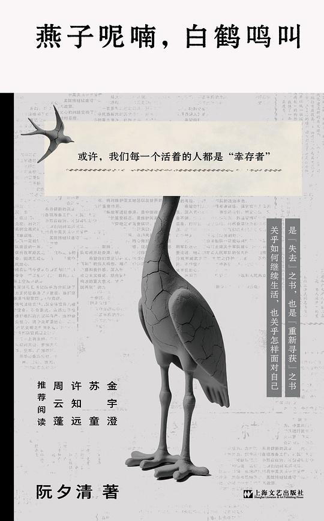 | 燕子呢喃，白鹤鸣叫 | 阮夕清 | ★★★☆☆ | 2026-09-09 | 营销过度了。 [全文](../reviews/book-37290908-燕子呢喃，白鹤鸣叫.md) | [NeoDB](https://neodb.social/book/15ywFCXO0pFbTSW0shxmrc) [豆瓣](https://book.douban.com/subject/37290908/) |
| [封面](https://img9.doubanio.com/view/subject/s/public/s29610326.jpg) | 我らコンタクティ | 森田るい | ★★★☆☆ | 2026-08-13 | 还算有意思 [全文](../reviews/book-27173667-我らコンタクティ.md) | [NeoDB](https://neodb.social/book/6p6bgNPmCytuBHFnGqHcIX) [豆瓣](https://book.douban.com/subject/27173667/) |
| 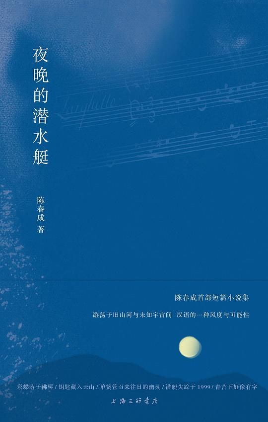 | 夜晚的潜水艇 | 陈春成 | ★★★★☆ | 2026-06-14 | 相当喜欢，很对上电波 [全文](../reviews/book-35005045-夜晚的潜水艇.md) | [NeoDB](https://neodb.social/book/6qPDyUhNN8ZEP9v5YVU7tx) [豆瓣](https://book.douban.com/subject/35005045/) |
| — | 明日仍將戀上他 | 入間人間/左 | ★★☆☆☆ | 2026-04-02 | 1 [全文](../reviews/book-20272305-明日仍將戀上他.md) | [NeoDB](https://neodb.social/book/3aajKpki7gzMoXhYf5Ky0R) [豆瓣](https://book.douban.com/subject/20272305/) |
| — | 昨日也曾愛著他 | 入間人間/左 | ★★☆☆☆ | 2026-04-02 | 水课在轻小说文库里偶然翻到遂把上下两本都看了 [全文](../reviews/book-10824791-昨日也曾愛著他.md) | [NeoDB](https://neodb.social/book/43g4Z0sOeETUNGFJKeMnX9) [豆瓣](https://book.douban.com/subject/10824791/) |
| [封面](https://img9.doubanio.com/view/subject/s/public/s34758936.jpg) | 藤本树短篇集 17-21 | [日] 藤本树 | ★★★★★ | 2026-03-25 | 水课上读完了第二遍 [全文](../reviews/book-36639380-藤本树短篇集-17-21.md) | [NeoDB](https://neodb.social/book/018Pg2dgdK5do0NOV8GHce) [豆瓣](https://book.douban.com/subject/36639380/) |
| — | 炎拳 | 藤本タツキ | ★★★★★ | 2026-03-18 | 第一遍是大一刚开学坐在操场上读完的，最近读完了第二遍，很短特的一部作品 [全文](../reviews/book-book-50TIwTCjd3UR1X5IEaB2Th-炎拳.md) | [NeoDB](https://neodb.social/book/50TIwTCjd3UR1X5IEaB2Th) |
| [封面](https://img9.doubanio.com/view/subject/s/public/s34667686.jpg) | 雪国（2022） | [日] 川端康成 | ★★★★☆ | 2025-05-13 | 补标 [全文](../reviews/book-35818897-雪国（2022）.md) | [NeoDB](https://neodb.social/book/1qO0OJSarmlaMgLgeD8MT0) [豆瓣](https://book.douban.com/subject/35818897/) |
| 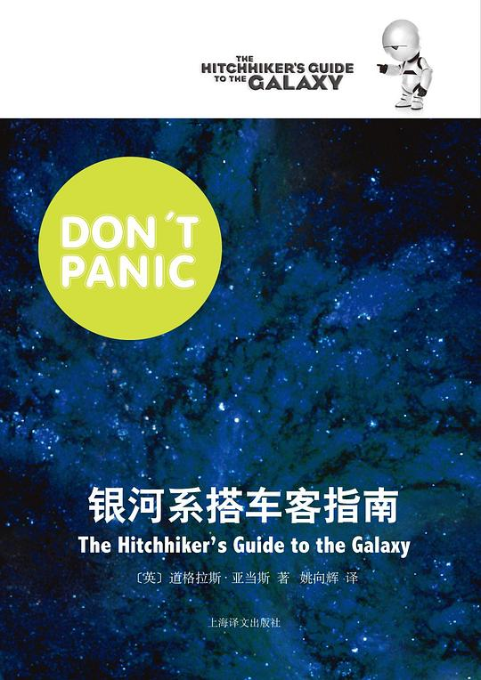 | 银河系搭车客指南 | [英] 道格拉斯·亚当斯 | ★★★★☆ | 2025-05-07 | 5月8日08:19:57英语课 [全文](../reviews/book-6265745-银河系搭车客指南.md) | [NeoDB](https://neodb.social/book/7J1vDXb5pS3fwfrVhRylPT) [豆瓣](https://book.douban.com/subject/6265745/) |
| 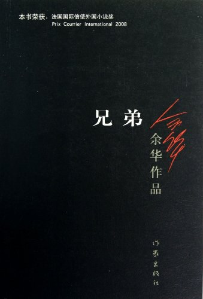 | 兄弟 | 余华 | ★★★★★ | 2025-05-02 | 5月3日10:30:47在宿舍读完 [全文](../reviews/book-20441957-兄弟.md) | [NeoDB](https://neodb.social/book/7FPmhGluhNTaJFpOhCXzAH) [豆瓣](https://book.douban.com/subject/20441957/) |
| [封面](https://img9.doubanio.com/view/subject/s/public/s29773195.jpg) | 与罗摩相会 | [英] 阿瑟·克拉克 | 未评分 | 2025-05-02 | 很久之前看过，已经忘的差不多了，补标 [全文](../reviews/book-30161861-与罗摩相会.md) | [NeoDB](https://neodb.social/book/3S9OS4tyCJ5goMGE46UKpb) [豆瓣](https://book.douban.com/subject/30161861/) |
|  | 文城 | 余华 | 未评分 | 2025-04-07 | 很早之前在集训的时候读过 [全文](../reviews/book-35335514-文城.md) | [NeoDB](https://neodb.social/book/0WhdElm9GvmYjJbcxsoPfL) [豆瓣](https://book.douban.com/subject/35335514/) |
| 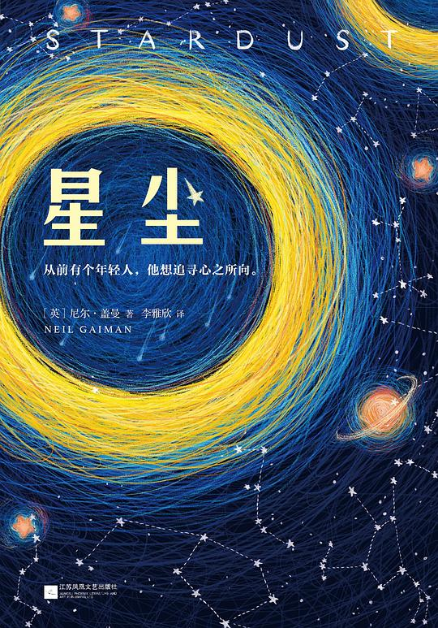 | 星尘 | (英) 尼尔·盖曼 (Neil Gaiman) | 未评分 | 2025-04-07 | 很久之前读过，忘记标了 [全文](../reviews/book-30270242-星尘.md) | [NeoDB](https://neodb.social/book/1Nei2PajjFbpt002jH3FAf) [豆瓣](https://book.douban.com/subject/30270242/) |
| 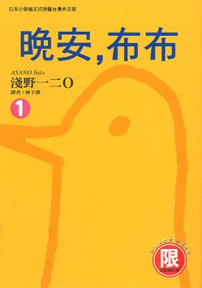 | 晚安，布布(01) | 浅野いにお | ★★★★★ | 2025-03-10 |  | [NeoDB](https://neodb.social/book/3erPShUuTfvq3JloNtYayO) [豆瓣](https://book.douban.com/subject/3094201/) |
| 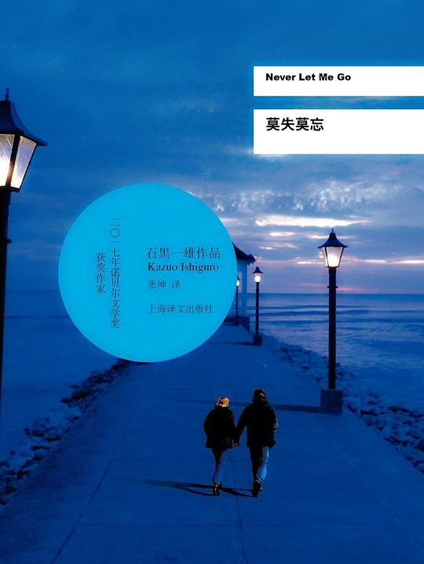 | 莫失莫忘 | [英] 石黑一雄 | ★★★★☆ | 2025-03-02 | 很久之前看过许的，没有看完 [全文](../reviews/book-30181685-莫失莫忘.md) | [NeoDB](https://neodb.social/book/6td8kLRbGyYpWeq9KCnHLY) [豆瓣](https://book.douban.com/subject/30181685/) |
|  | 书与钥匙的季节 | [日] 米泽穗信 | ★★★★☆ | 2025-02-24 | 两天看完了，还是学校适合看书 [全文](../reviews/book-35651703-书与钥匙的季节.md) | [NeoDB](https://neodb.social/book/6VhWnSc9Lotn4MKgDpJBwN) [豆瓣](https://book.douban.com/subject/35651703/) |
| [封面](https://img9.doubanio.com/view/subject/s/public/s29827014.jpg) | 恶意 | [日] 东野圭吾 | ★★★☆☆ | 2025-01-29 | 很久之前老哥送的一整套，四本 [全文](../reviews/book-26877752-恶意.md) | [NeoDB](https://neodb.social/book/4L74hoR4OJL8qROiqubs5t) [豆瓣](https://book.douban.com/subject/26877752/) |
| 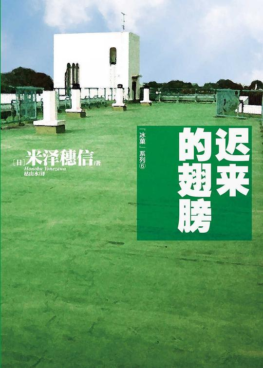 | 迟来的翅膀 | [日] 米泽穗信 | ★★★★★ | 2024-10-29 | 10月30日17:36习思 [全文](../reviews/book-27070071-迟来的翅膀.md) | [NeoDB](https://neodb.social/book/4mjwJUnf2AZ1W2pP1ZfLgm) [豆瓣](https://book.douban.com/subject/27070071/) |
| 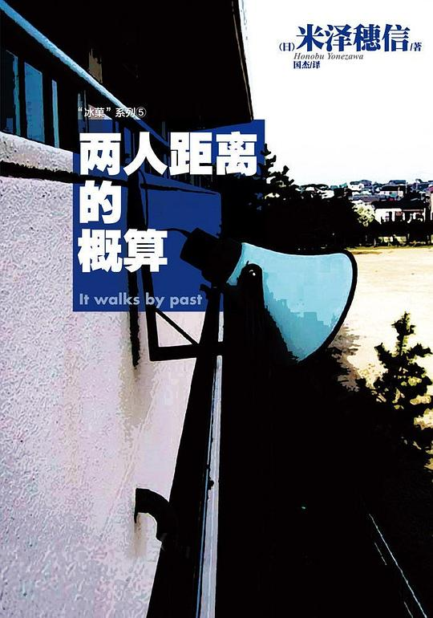 | 两人距离的概算 | [日] 米泽穗信 | ★★★★★ | 2024-10-22 | 10月23日19:31:45 [全文](../reviews/book-25885612-两人距离的概算.md) | [NeoDB](https://neodb.social/book/0mg5sEl27Dyrgr0IEPPqFE) [豆瓣](https://book.douban.com/subject/25885612/) |
|  | 恋爱寄生虫 | [日] 三秋缒 | ★★★★☆ | 2024-09-25 | 花了半节水课，半节线代看完了 [全文](../reviews/book-33372392-恋爱寄生虫.md) | [NeoDB](https://neodb.social/book/3Fa7OmvH80PtaKZnThRGY4) [豆瓣](https://book.douban.com/subject/33372392/) |
| [封面](https://img9.doubanio.com/view/subject/s/public/s34802556.jpg) | 尘埃落定 | 阿来 | ★★★★★ | 2024-03-30 | 百年孤独+红楼梦的感觉 [全文](../reviews/book-35051822-尘埃落定.md) | [NeoDB](https://neodb.social/book/1otSUJUxaTDcA6ogufblnb) [豆瓣](https://book.douban.com/subject/35051822/) |
|  | 红手指 | [日] 东野圭吾 | ★★★★☆ | 2024-03-23 | 结尾怪怪的 [全文](../reviews/book-26651926-红手指.md) | [NeoDB](https://neodb.social/book/1QRbVyXejWqrF9sV9oEoJU) [豆瓣](https://book.douban.com/subject/26651926/) |
|  | 愚者的片尾 | [日] 米泽穗信 | ★★★★★ | 2024-02-16 |  | [NeoDB](https://neodb.social/book/5ZowD89qnFhKkaxpznzm63) [豆瓣](https://book.douban.com/subject/24853056/) |
|  | 冰菓 | [日] 米泽穗信 | ★★★★★ | 2024-02-15 |  | [NeoDB](https://neodb.social/book/7TKNLd3kerzGQ3zp9fMl75) [豆瓣](https://book.douban.com/subject/24383185/) |
| [封面](https://img9.doubanio.com/view/subject/s/public/s34283794.jpg) | 蓦然回首 | [日] 藤本树 | ★★★★★ | 2023-09-27 | 9月28日于操场读完 [全文](../reviews/book-35801543-蓦然回首.md) | [NeoDB](https://neodb.social/book/10UR8JmVyyJPl3FT1iPW8y) [豆瓣](https://book.douban.com/subject/35801543/) |
|  | 三日间的幸福 | [日] 三秋缒 | ★★★★★ | 2023-09-14 | 第二遍 [全文](../reviews/book-26980300-三日间的幸福.md) | [NeoDB](https://neodb.social/book/2jZUicz4exqqGvgGezN9te) [豆瓣](https://book.douban.com/subject/26980300/) |
|  | 通往夏天的隧道，再见的出口 | [日] 八目迷 | ★★★☆☆ | 2023-08-07 | 像是高中生会写出来的小说 [全文](../reviews/book-36094872-通往夏天的隧道，再见的出口.md) | [NeoDB](https://neodb.social/book/0uAXPF0HGrDadZEZv08RJL) [豆瓣](https://book.douban.com/subject/36094872/) |
| 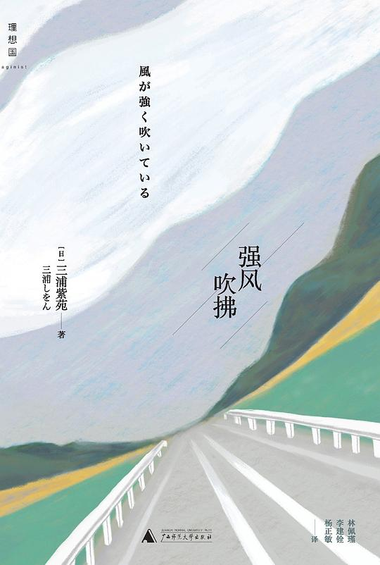 | 强风吹拂 | [日] 三浦紫苑 | ★★★☆☆ | 2023-08-04 | 9.0评分偏高，打个三星中和一下 [全文](../reviews/book-26210487-强风吹拂.md) | [NeoDB](https://neodb.social/book/1jt41ggFdzK0MlaiGFPuSf) [豆瓣](https://book.douban.com/subject/26210487/) |
| 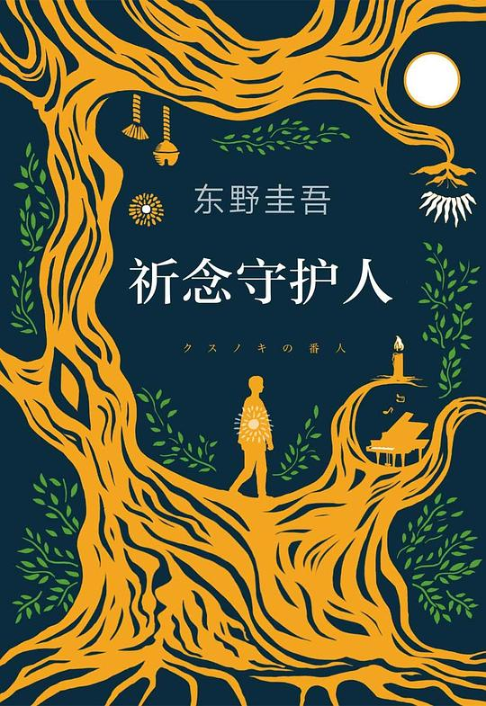 | 祈念守护人 | [日] 东野圭吾 | ★★★☆☆ | 2023-08-02 | 晚自习读完，谢谢jx [全文](../reviews/book-35017604-祈念守护人.md) | [NeoDB](https://neodb.social/book/1FuOLw3Nhw7ny6ig4WzTMJ) [豆瓣](https://book.douban.com/subject/35017604/) |
| 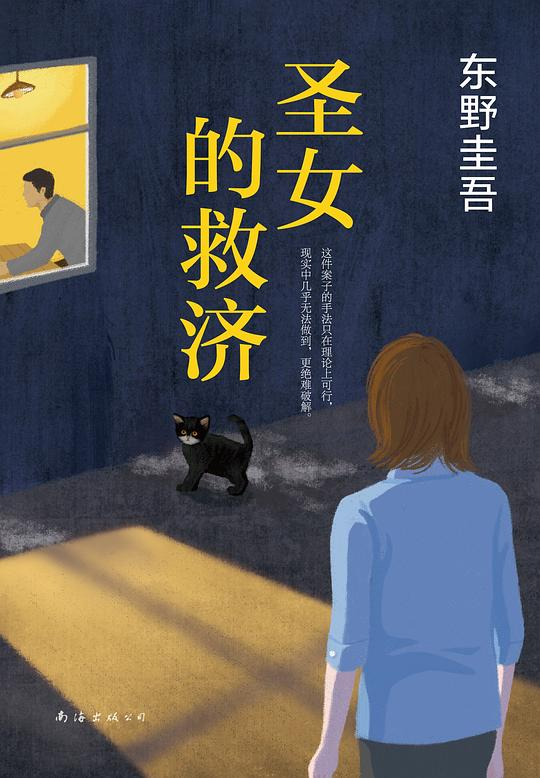 | 圣女的救济 | [日] 东野圭吾 | ★★★☆☆ | 2023-08-01 |  | [NeoDB](https://neodb.social/book/3G3PUT0usVIPE4qHgvpTs0) [豆瓣](https://book.douban.com/subject/26906797/) |
|  | 冰菓漫画 13-14 | [日] TASKOHNA 编绘、[日] 米泽穗信 原作 | ★★★★★ | 2023-07-30 | zzd [全文](../reviews/book-36363217-冰菓漫画-13-14.md) | [NeoDB](https://neodb.social/book/65K8qy3CwVvHXjAyVaKAfj) [豆瓣](https://book.douban.com/subject/36363217/) |
| 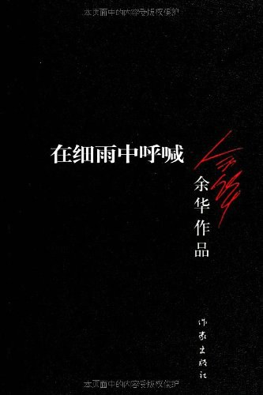 | 在细雨中呼喊 | 余华 | ★★★★☆ | 2023-07-30 | 集训 两天读完 [全文](../reviews/book-20421947-在细雨中呼喊.md) | [NeoDB](https://neodb.social/book/4XSJCRNVlWvtYKaZEF8jPk) [豆瓣](https://book.douban.com/subject/20421947/) |
| [封面](https://img9.doubanio.com/view/subject/s/public/s27218035.jpg) | 冰与火之歌 | [美]乔治·R.R.马丁 | ★★★★★ | 2023-07-25 |  | [NeoDB](https://neodb.social/book/4BnobMXU8EKnaancjG9jvH) [豆瓣](https://book.douban.com/subject/25826936/) |
| [封面](https://img9.doubanio.com/view/subject/s/public/s2651394.jpg) | 灿烂千阳 | [美] 卡勒德·胡赛尼 | ★★★★★ | 2023-07-25 | 7月26日21:39晚自习 [全文](../reviews/book-2143732-灿烂千阳.md) | [NeoDB](https://neodb.social/book/1xbljMe9ztw20sdGbbe7sA) [豆瓣](https://book.douban.com/subject/2143732/) |
|  | 第七天 | 余华 | ★★★★★ | 2023-07-16 | 荒诞而又现实 [全文](../reviews/book-24540864-第七天.md) | [NeoDB](https://neodb.social/book/25Ef7mh4PDn34g7QD2Kc9P) [豆瓣](https://book.douban.com/subject/24540864/) |
| 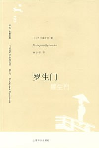 | 罗生门 | [日] 芥川龙之介 | ★★★★★ | 2023-06-23 |  | [NeoDB](https://neodb.social/book/0dx3EfYQ3K5gfrISl7gsKE) [豆瓣](https://book.douban.com/subject/3136271/) |
| 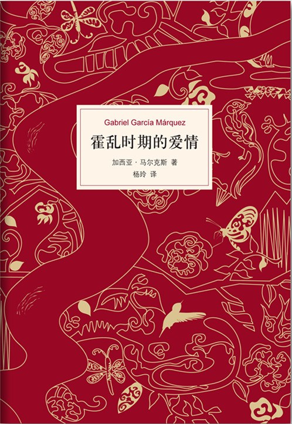 | 霍乱时期的爱情 | [哥伦比亚] 加西亚·马尔克斯 | ★★★★★ | 2023-05-23 |  | [NeoDB](https://neodb.social/book/0TC2pzkdlnZHB8iOB7HKuE) [豆瓣](https://book.douban.com/subject/10594787/) |
| 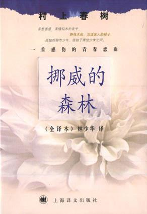 | 挪威的森林 | [日] 村上春树 | ★★★★☆ | 2023-05-08 | 不喜欢男主 [全文](../reviews/book-1046265-挪威的森林.md) | [NeoDB](https://neodb.social/book/0dgpnqTv6UYavkKc2625PN) [豆瓣](https://book.douban.com/subject/1046265/) |
| 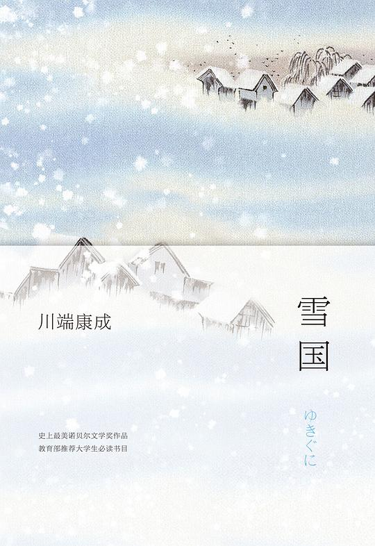 | 雪国 | [日本] 川端康成 | ★★★★☆ | 2023-05-02 | 细腻 [全文](../reviews/book-24736899-雪国.md) | [NeoDB](https://neodb.social/book/4efLUTHXxl1TFRzDpYbg3w) [豆瓣](https://book.douban.com/subject/24736899/) |
| [封面](https://img9.doubanio.com/view/subject/s/public/s34099286.jpg) | 呐喊 | 鲁迅 | 未评分 | 2023-02-26 |  | [NeoDB](https://neodb.social/book/4MFiRhOCK2RddnliFVq4PG) [豆瓣](https://book.douban.com/subject/1449351/) |
| 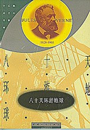 | 八十天环游地球 | [法] 儒勒·凡尔纳 | 未评分 | 2023-02-26 |  | [NeoDB](https://neodb.social/book/1RKdqQrKWBhlyVEXkC6I6O) [豆瓣](https://book.douban.com/subject/1275907/) |
| 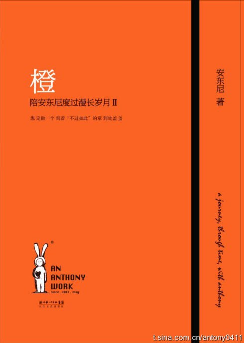 | 橙 | 安东尼 | 未评分 | 2023-02-26 |  | [NeoDB](https://neodb.social/book/4JMAns06qggw7LXanXAugL) [豆瓣](https://book.douban.com/subject/5327697/) |
| 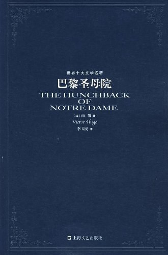 | 巴黎圣母院 | 雨果 | 未评分 | 2023-02-26 |  | [NeoDB](https://neodb.social/book/0fkvhy5RBOChyc3fRgcWXd) [豆瓣](https://book.douban.com/subject/2253413/) |
|  | 瓦尔登湖 | [美] 梭罗 | 未评分 | 2023-02-26 |  | [NeoDB](https://neodb.social/book/10GFXy3MzhsXqF4u8LTI5z) [豆瓣](https://book.douban.com/subject/1865089/) |
| 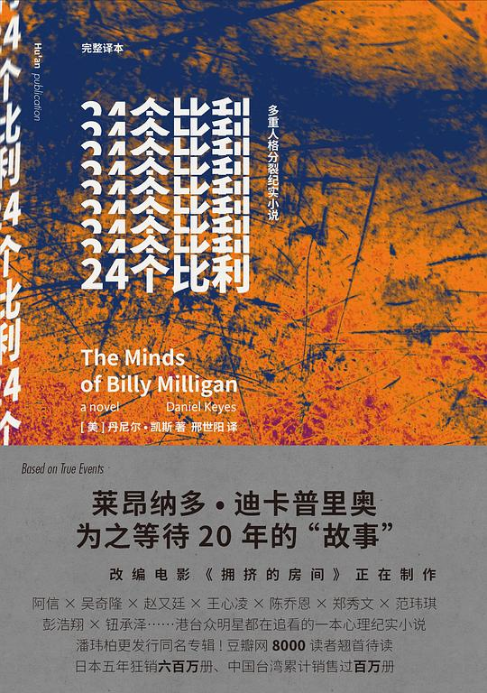 | 24个比利 | [美] 丹尼尔·凯斯 | 未评分 | 2023-02-26 |  | [NeoDB](https://neodb.social/book/6A6OkiZHqgZGevcIRSGs0y) [豆瓣](https://book.douban.com/subject/26371317/) |
| [封面](https://img9.doubanio.com/view/subject/s/public/s3814606.jpg) | 恶意 | [日] 东野圭吾 | 未评分 | 2023-02-26 |  | [NeoDB](https://neodb.social/book/5ApPu0rNPyycLIGeVvxdYe) [豆瓣](https://book.douban.com/subject/3646172/) |
| [封面](https://img9.doubanio.com/view/subject/s/public/s29869926.jpg) | 活着 | 余华 | 未评分 | 2023-02-26 |  | [NeoDB](https://neodb.social/book/6HEM4B7Qn0zt5Qb1eZpzag) [豆瓣](https://book.douban.com/subject/4913064/) |
| [封面](https://img9.doubanio.com/view/subject/s/public/s1989294.jpg) | 钢铁是怎样炼成的 | 奥斯特洛夫斯基 | 未评分 | 2023-02-26 |  | [NeoDB](https://neodb.social/book/1N07Tzv7VCE24qK9oCtKYd) [豆瓣](https://book.douban.com/subject/1894744/) |
|  | 父与子全集 | [德] 埃·奥·卜劳恩 绘 | 未评分 | 2023-02-26 |  | [NeoDB](https://neodb.social/book/7LYBUSQC50STn6Mn2Go9BJ) [豆瓣](https://book.douban.com/subject/1002898/) |
| [封面](https://img9.doubanio.com/view/subject/s/public/s1072746.jpg) | 哈利·波特与火焰杯 | [英] J. K. 罗琳 | 未评分 | 2023-02-26 |  | [NeoDB](https://neodb.social/book/38bisXBEXG4qdj2vHKM5SX) [豆瓣](https://book.douban.com/subject/1009257/) |
| 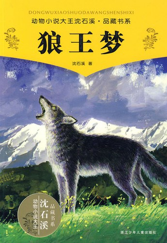 | 狼王梦 | 沈石溪 | 未评分 | 2023-02-26 |  | [NeoDB](https://neodb.social/book/7lEW0zDpBsvBhYSzQ34kOv) [豆瓣](https://book.douban.com/subject/4061972/) |
|  | さよなら絵梨 [Sayonara Eri] | 藤本 タツキ | ★★★★★ | 2022-11-15 | 独特 [全文](../reviews/book-35914464-さよなら絵梨-[Sayonara-Eri].md) | [NeoDB](https://neodb.social/book/1b1CFLGCbXnY067GPMplNE) [豆瓣](https://book.douban.com/subject/35914464/) |
| 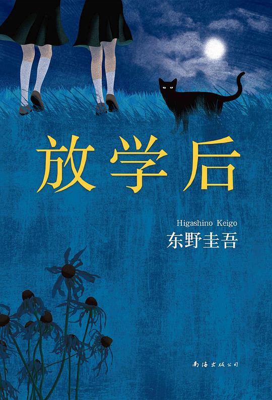 | 放学后 | [日] 东野圭吾 | ★★★☆☆ | 2022-09-20 | 男主老婆这个人物塑造的也太单薄了，却偏偏要在结尾这样给她安排一个情节 [全文](../reviews/book-27102207-放学后.md) | [NeoDB](https://neodb.social/book/2cb3M0EaJWWnLjnUxR678B) [豆瓣](https://book.douban.com/subject/27102207/) |
|  | 太年轻 | [美]加·泽文 | ★★★★☆ | 2022-09-14 |  | [NeoDB](https://neodb.social/book/7G89IWkPYx4HPlsjPHC0dR) [豆瓣](https://book.douban.com/subject/30161866/) |
| 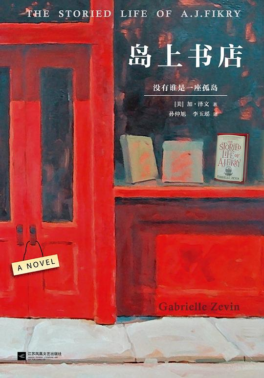 | 岛上书店 | [美] 加布瑞埃拉·泽文 | ★★★★☆ | 2022-09-14 |  | [NeoDB](https://neodb.social/book/2AbibIOpd5mW3oWslfnrdd) [豆瓣](https://book.douban.com/subject/26340138/) |
| 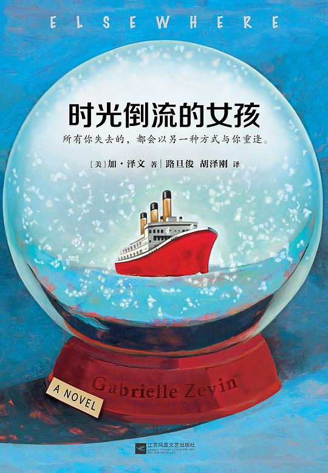 | 时光倒流的女孩 | [美] 加·泽文 | ★★★★★ | 2022-09-14 | 加泽文最喜欢的还是这本 [全文](../reviews/book-26998358-时光倒流的女孩.md) | [NeoDB](https://neodb.social/book/6B1TnZHr8bLyWZ9SYmhJHh) [豆瓣](https://book.douban.com/subject/26998358/) |
|  | 玛格丽特小镇 | [美] 加·泽文 | ★★★☆☆ | 2022-09-14 |  | [NeoDB](https://neodb.social/book/2OjE8mBNiQZmp2MGC1kDNG) [豆瓣](https://book.douban.com/subject/26787941/) |
| 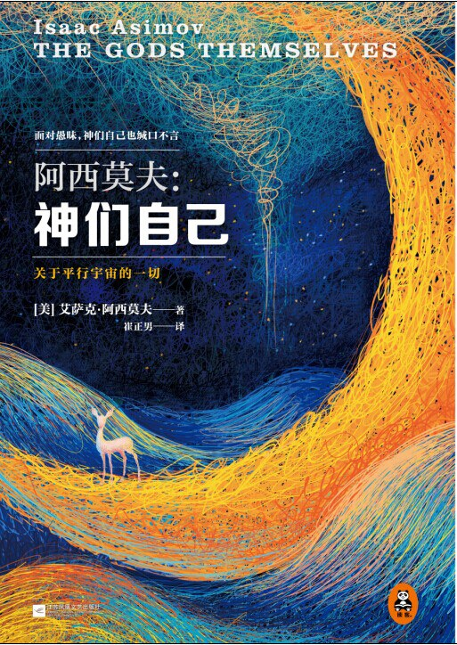 | 神们自己 | [美] 艾萨克·阿西莫夫 | ★★★★☆ | 2022-09-14 |  | [NeoDB](https://neodb.social/book/363Q6MYw57OCXWC8NuoP02) [豆瓣](https://book.douban.com/subject/26264967/) |
| 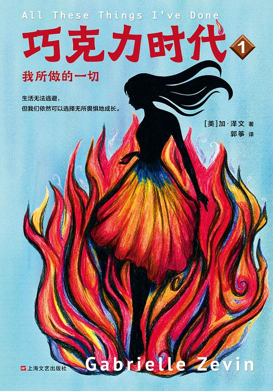 | 巧克力时代 | 加布瑞埃拉·泽文 | ★★★☆☆ | 2022-09-14 |  | [NeoDB](https://neodb.social/book/25XVDNfwFFVwAF7tCBJbDv) [豆瓣](https://book.douban.com/subject/30309784/) |
| [封面](https://img9.doubanio.com/view/subject/s/public/s26849345.jpg) | 无人生还 | [英] 阿加莎·克里斯蒂 | ★★★☆☆ | 2022-08-05 | 8月6日晚 两天读完 [全文](../reviews/book-24859822-无人生还.md) | [NeoDB](https://neodb.social/book/2hDOKC6Hg84PjyNE6wa0yA) [豆瓣](https://book.douban.com/subject/24859822/) |
| 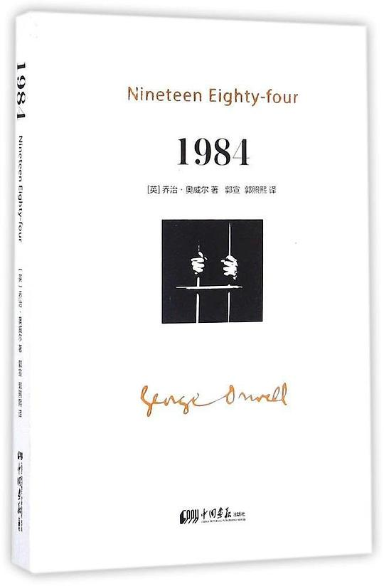 | 1984 | 乔治·奥威尔 | ★★★★★ | 2022-08-01 | 8月2日 集训 重读 [全文](../reviews/book-26974777-1984.md) | [NeoDB](https://neodb.social/book/0CPvFFckO6rZUuuFxDgjyD) [豆瓣](https://book.douban.com/subject/26974777/) |
| 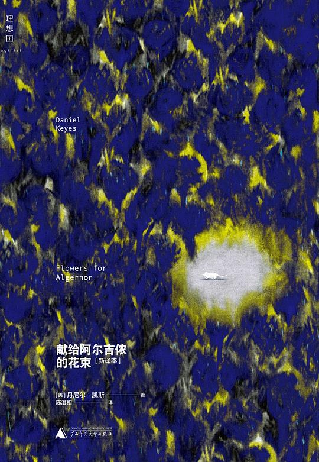 | 献给阿尔吉侬的花束 | [美] 丹尼尔·凯斯 | ★★★★★ | 2022-07-30 | 7月31日集训时读完 [全文](../reviews/book-26362836-献给阿尔吉侬的花束.md) | [NeoDB](https://neodb.social/book/4RcTj1AilRVONB8RIKJSVA) [豆瓣](https://book.douban.com/subject/26362836/) |
| 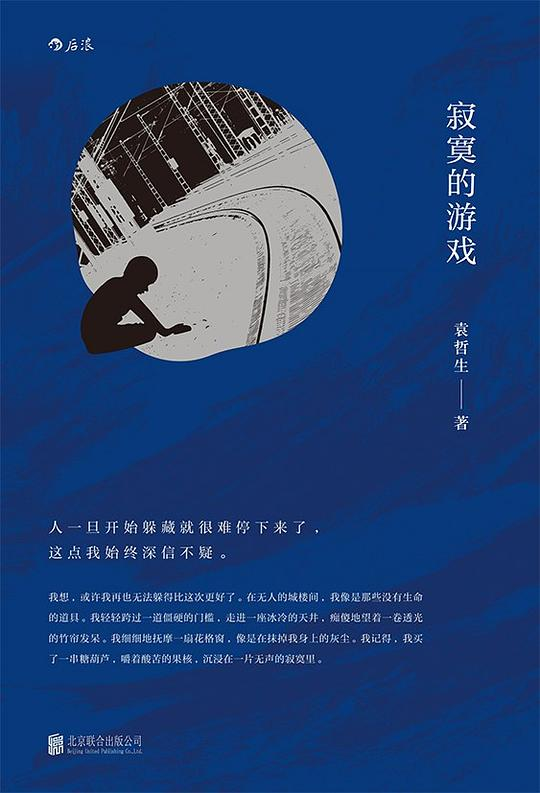 | 寂寞的游戏 | 袁哲生 | ★★★★★ | 2022-03-16 | 很想推荐给别人 [全文](../reviews/book-27104286-寂寞的游戏.md) | [NeoDB](https://neodb.social/book/0LyzIHLhIZuApnOXkguZjs) [豆瓣](https://book.douban.com/subject/27104286/) |
|  | 许三观卖血记 | 余华 | ★★★★★ | 2022-02-14 |  | [NeoDB](https://neodb.social/book/4tvMgmCZtnRo56WGqFkWY2) [豆瓣](https://book.douban.com/subject/1029791/) |
| [封面](https://img9.doubanio.com/view/subject/s/public/s29443244.jpg) | 神奇动物在哪里 | [英] J. K. 罗琳 | ★★★★★ | 2022-02-02 |  | [NeoDB](https://neodb.social/book/0nySdV2rTzWePUKrWfi7Pl) [豆瓣](https://book.douban.com/subject/26984868/) |
|  | 你的名字 | 新海诚 | ★★★★☆ | 2021-12-30 | 凯翔送的 [全文](../reviews/book-26916709-你的名字.md) | [NeoDB](https://neodb.social/book/2JIFavaG46Ut5Mzod9xLbQ) [豆瓣](https://book.douban.com/subject/26916709/) |
|  | 许三观卖血记 | 余华 | ★★★★★ | 2021-12-28 | 最近读完。结尾实在虐心… [全文](../reviews/book-4760224-许三观卖血记.md) | [NeoDB](https://neodb.social/book/7azG0zJkXCkeG6i4hBXAfY) [豆瓣](https://book.douban.com/subject/4760224/) |
| [封面](https://img9.doubanio.com/view/subject/s/public/s33684075.jpg) | 飞吧，黑居易 刘耀辉诗意成长书系 | 刘耀辉 | ★★★★☆ | 2021-12-10 | zgs [全文](../reviews/book-33411515-飞吧，黑居易-刘耀辉诗意成长书系.md) | [NeoDB](https://neodb.social/book/2Ke3amuM1NFxYzGMTYNdJP) [豆瓣](https://book.douban.com/subject/33411515/) |
| [封面](https://img9.doubanio.com/view/subject/s/public/s1817666.jpg) | 海底两万里 | [法国] 儒尔·凡尔纳 | ★★★★☆ | 2021-12-10 |  | [NeoDB](https://neodb.social/book/4kWe8S9ckRjkxi28AHwxEA) [豆瓣](https://book.douban.com/subject/1085470/) |
| 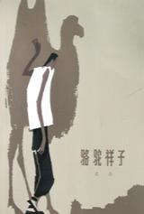 | 骆驼祥子 | 老舍 | ★★★★☆ | 2021-12-10 |  | [NeoDB](https://neodb.social/book/3pJymATNDKQ3amoO7vhFhR) [豆瓣](https://book.douban.com/subject/1043815/) |
|  | 夏洛的网 | [美] E.B.怀特、[美国] 埃尔温·布鲁克斯·怀特 | ★★★★☆ | 2021-12-10 |  | [NeoDB](https://neodb.social/book/6KzJDSCbQUepJjzc4Amwus) [豆瓣](https://book.douban.com/subject/1036274/) |
| 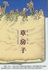 | 草房子 | 曹文轩 | 未评分 | 2021-12-10 |  | [NeoDB](https://neodb.social/book/4S1wztqpkyuiqZjN8xWzUv) [豆瓣](https://book.douban.com/subject/1052990/) |
| 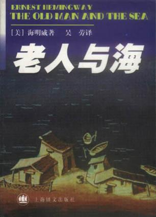 | 老人与海 | [美]海明威 | ★★★★★ | 2021-12-10 |  | [NeoDB](https://neodb.social/book/3oQZcaWzRDzIP9iEr3h55v) [豆瓣](https://book.douban.com/subject/1064275/) |
|  | 巴黎圣母院 | [法]雨果 | ★★★★★ | 2021-12-10 |  | [NeoDB](https://neodb.social/book/1YR33J37soX9GBMsu39Us2) [豆瓣](https://book.douban.com/subject/1024197/) |
| [封面](https://img9.doubanio.com/view/subject/s/public/s5924326.jpg) | 简爱（英文全本） | [英] 夏洛蒂·勃朗特 | ★★★★☆ | 2021-12-10 | 甜 [全文](../reviews/book-1141406-简爱（英文全本）.md) | [NeoDB](https://neodb.social/book/47nAirgkQMaHbeq5b1CkwB) [豆瓣](https://book.douban.com/subject/1141406/) |
| 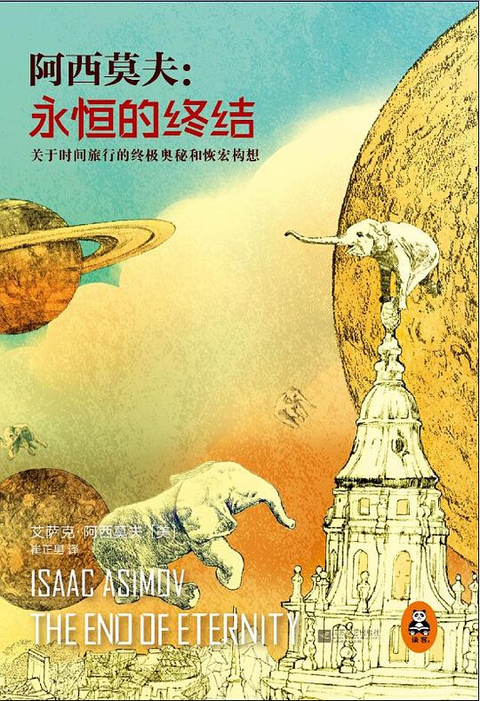 | 永恒的终结 | [美] 艾萨克·阿西莫夫 | ★★★★☆ | 2021-12-10 | 在医院里手术前读的 记得还带了一本瓦尔登湖 但只有这本看完了 [全文](../reviews/book-25829693-永恒的终结.md) | [NeoDB](https://neodb.social/book/5viDBjpbSUtoYJgPIMvtLt) [豆瓣](https://book.douban.com/subject/25829693/) |
| 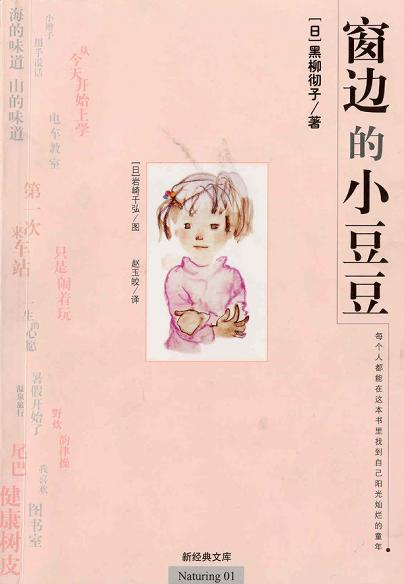 | 窗边的小豆豆 | [日] 黑柳彻子 著、岩崎千弘 图 | 未评分 | 2021-12-10 | 大都忘记了 有时间打算重温 [全文](../reviews/book-1007914-窗边的小豆豆.md) | [NeoDB](https://neodb.social/book/09np7N0m5w080oJxOAMhYh) [豆瓣](https://book.douban.com/subject/1007914/) |
| 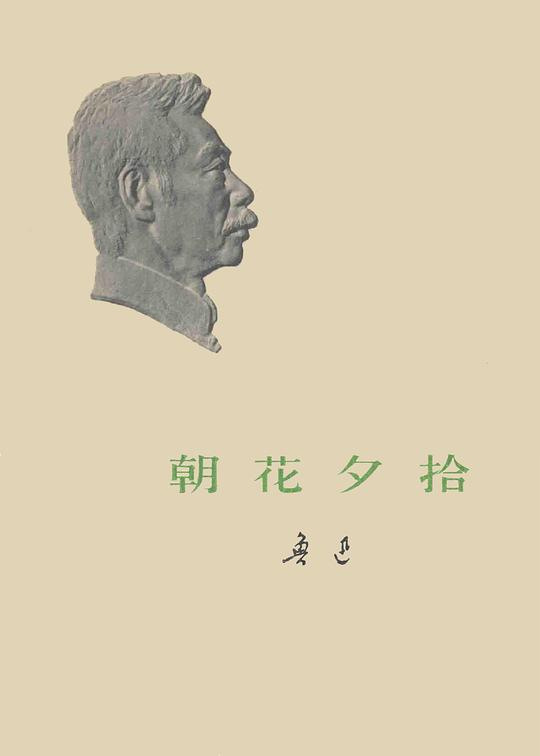 | 朝花夕拾 | 鲁迅 | ★★★★☆ | 2021-12-10 |  | [NeoDB](https://neodb.social/book/2lLmzuquJA68RwHwvQptWY) [豆瓣](https://book.douban.com/subject/1449352/) |
| 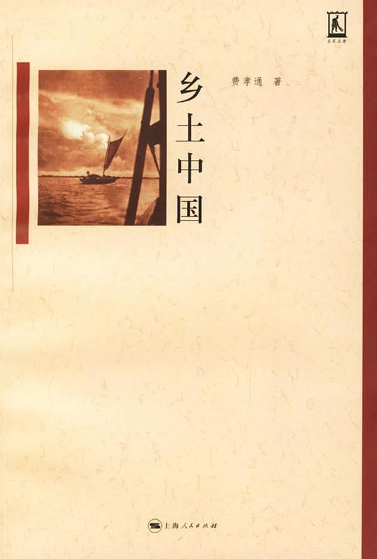 | 乡土中国 | 费孝通 | ★★★★☆ | 2021-12-10 | 有所收获 也是第一次读学术类作品 [全文](../reviews/book-1795079-乡土中国.md) | [NeoDB](https://neodb.social/book/6WypX3FL8A6hZikIWuuLHW) [豆瓣](https://book.douban.com/subject/1795079/) |
| [封面](https://img9.doubanio.com/view/subject/s/public/s29101586.jpg) | 哈利·波特 | [英] J·K·罗琳 | ★★★★★ | 2021-12-10 |  | [NeoDB](https://neodb.social/book/0BlI2YA8p1GddzqkFq8F4k) [豆瓣](https://book.douban.com/subject/24531956/) |
| 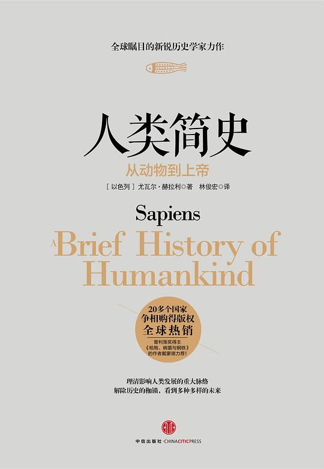 | 人类简史 | [以色列] 尤瓦尔·赫拉利 | ★★★★☆ | 2021-12-10 |  | [NeoDB](https://neodb.social/book/51bFn01lYsM5uXnOJ9WM3P) [豆瓣](https://book.douban.com/subject/25985021/) |
| 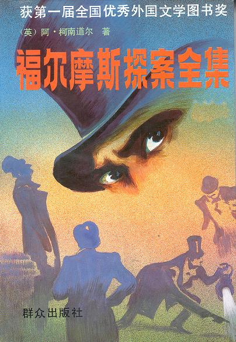 | 福尔摩斯探案全集（上中下） | [英] 阿·柯南道尔 | ★★★★☆ | 2021-12-10 |  | [NeoDB](https://neodb.social/book/0NnNMDppF2bQqFyPMwyuYn) [豆瓣](https://book.douban.com/subject/1040211/) |
| 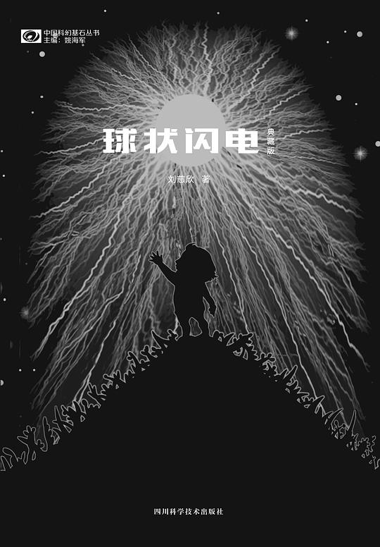 | 球状闪电 | 刘慈欣 | ★★★★☆ | 2021-12-10 |  | [NeoDB](https://neodb.social/book/0zc5Kdk8MzwINNpfAVLSJ0) [豆瓣](https://book.douban.com/subject/26856061/) |
| [封面](https://img9.doubanio.com/view/subject/s/public/s28357056.jpg) | 三体全集 | 刘慈欣 | ★★★★★ | 2021-12-10 |  | [NeoDB](https://neodb.social/book/2URlzyNSCbC0bQsTzfHeAE) [豆瓣](https://book.douban.com/subject/6518605/) |
| 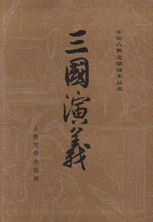 | 三国演义（全二册） | [明] 罗贯中 | ★★★★★ | 2021-12-10 | 小学时候就很喜欢 [全文](../reviews/book-1019568-三国演义（全二册）.md) | [NeoDB](https://neodb.social/book/7gbJHnD1XnG3UDdixTy2Vp) [豆瓣](https://book.douban.com/subject/1019568/) |
| 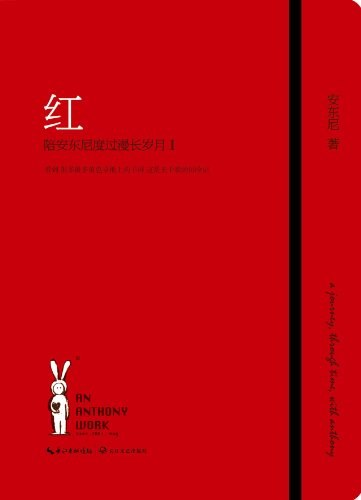 | 红 | 安东尼 | ★★★★☆ | 2021-11-27 |  | [NeoDB](https://neodb.social/book/33uh8882n6e9aNCzWe2qfk) [豆瓣](https://book.douban.com/subject/20424614/) |
| [封面](https://img9.doubanio.com/view/subject/s/public/s33492346.jpg) | 你当像鸟飞往你的山 | [美] 塔拉·韦斯特弗 | ★★★★☆ | 2021-09-04 | 喜欢第二部分的结尾，被戳到了 [全文](../reviews/book-33440205-你当像鸟飞往你的山.md) | [NeoDB](https://neodb.social/book/2mdEocABJPjYSzuEs2c5QC) [豆瓣](https://book.douban.com/subject/33440205/) |
| [封面](https://img9.doubanio.com/view/subject/s/public/s33544846.jpg) | 圆圈正义 | 罗翔 | ★★★★★ | 2021-08-29 | 自习课上借了同学的读了一节课 [全文](../reviews/book-34815132-圆圈正义.md) | [NeoDB](https://neodb.social/book/6VumzkOgPMNK69fjN2yb9P) [豆瓣](https://book.douban.com/subject/34815132/) |
| 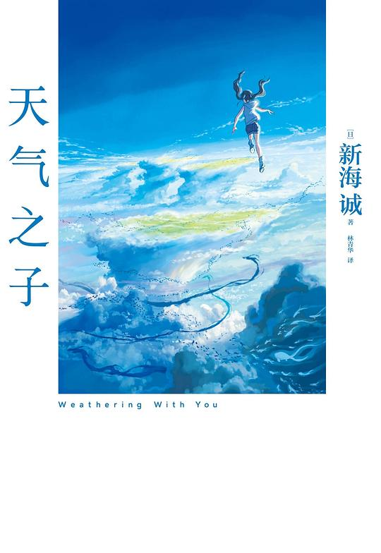 | 天气之子 | [日] 新海诚 | ★★★★☆ | 2021-08-21 |  | [NeoDB](https://neodb.social/book/2gXt0XzBOfMz0hicFlwYBF) [豆瓣](https://book.douban.com/subject/34799480/) |
|  | 解忧杂货店 | [日] 东野圭吾 | ★★★★☆ | 2021-08-21 |  | [NeoDB](https://neodb.social/book/4mfB3oI7xv9BPTtlicoQeG) [豆瓣](https://book.douban.com/subject/25862578/) |
| 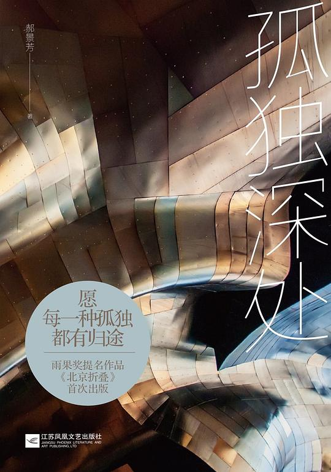 | 孤独深处 | 郝景芳 | ★★★☆☆ | 2021-08-21 |  | [NeoDB](https://neodb.social/book/6vRqsoFLMPKEW3ty8lXaXg) [豆瓣](https://book.douban.com/subject/26791407/) |
| [封面](https://img9.doubanio.com/view/subject/s/public/s29477615.jpg) | 美丽新世界 | 【英】奥尔德斯·赫胥黎 | ★★★★☆ | 2021-08-17 |  | [NeoDB](https://neodb.social/book/1kNyIg0YP721lKHoeHlvFE) [豆瓣](https://book.douban.com/subject/27002046/) |
| 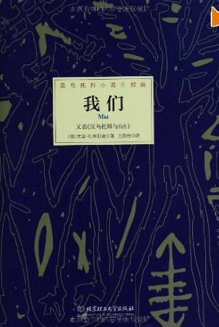 | 我们 | 尤金·扎米亚金 | ★★★★☆ | 2021-08-17 |  | [NeoDB](https://neodb.social/book/4SIPoJrGSFdemk2B37PnOH) [豆瓣](https://book.douban.com/subject/25838428/) |
| 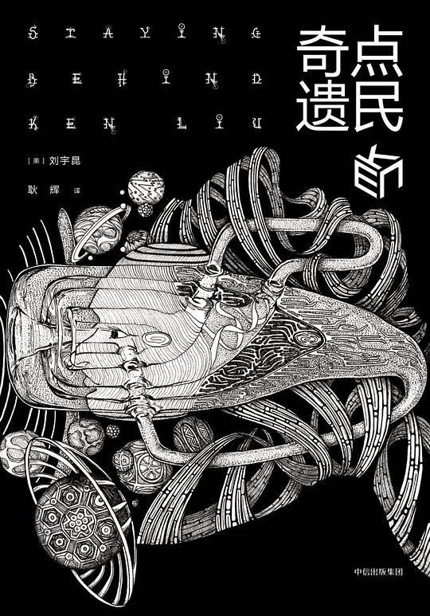 | 奇点遗民 | 【美】刘宇昆 | ★★★★★ | 2021-08-17 |  | [NeoDB](https://neodb.social/book/7j8QVuJtexUzXKSuW8nsyQ) [豆瓣](https://book.douban.com/subject/27077140/) |
| [封面](https://img9.doubanio.com/view/subject/s/public/s4007145.jpg) | 肖申克的救赎 | [美] 斯蒂芬·金 | ★★★★☆ | 2021-08-17 | 不太喜欢第二个故事 [全文](../reviews/book-1829226-肖申克的救赎.md) | [NeoDB](https://neodb.social/book/0VoNDaHX4R29ovDXOAvKC4) [豆瓣](https://book.douban.com/subject/1829226/) |
| 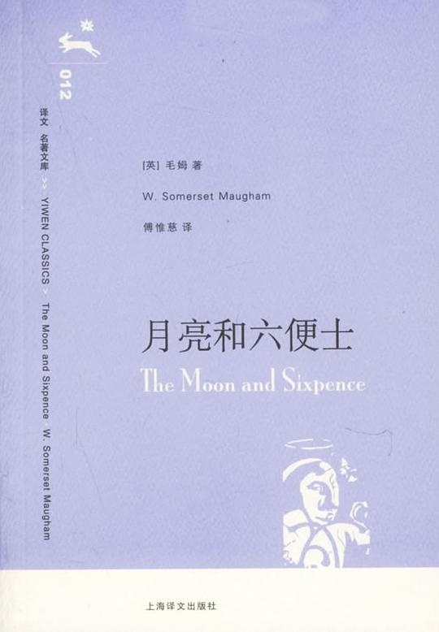 | 月亮和六便士 | [英] 毛姆 | ★★★★★ | 2021-08-17 |  | [NeoDB](https://neodb.social/book/0c7b2tDSC5kU8Nkzr3ZVBh) [豆瓣](https://book.douban.com/subject/1858513/) |
| 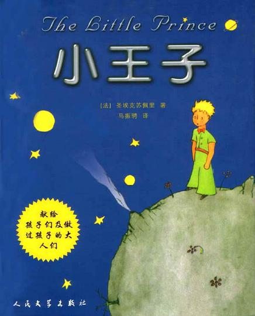 | 小王子 | [法] 安东尼·德·圣-埃克苏佩里 | ★★★★★ | 2021-08-17 | 完美的童话 [全文](../reviews/book-1084336-小王子.md) | [NeoDB](https://neodb.social/book/1AT5MpqfRMd4wEeOE1uGIF) [豆瓣](https://book.douban.com/subject/1084336/) |
|  | 动物农场 | [英] 乔治·奥威尔 | ★★★★★ | 2021-08-17 | 结局看的背后一凉 [全文](../reviews/book-2035179-动物农场.md) | [NeoDB](https://neodb.social/book/70PvDMdEMCLCv0sKKg56aI) [豆瓣](https://book.douban.com/subject/2035179/) |
|  | 追风筝的人 | [美] 卡勒德·胡赛尼 | ★★★★☆ | 2021-08-17 |  | [NeoDB](https://neodb.social/book/1UBGp593Cb5oNMUANS30Hk) [豆瓣](https://book.douban.com/subject/1770782/) |
| [封面](https://img9.doubanio.com/view/subject/s/public/s3254244.jpg) | 嫌疑人X的献身 | [日] 东野圭吾 | ★★★★☆ | 2021-08-17 |  | [NeoDB](https://neodb.social/book/77JSasU4Y3L4yxZ9PcJ022) [豆瓣](https://book.douban.com/subject/3211779/) |
| 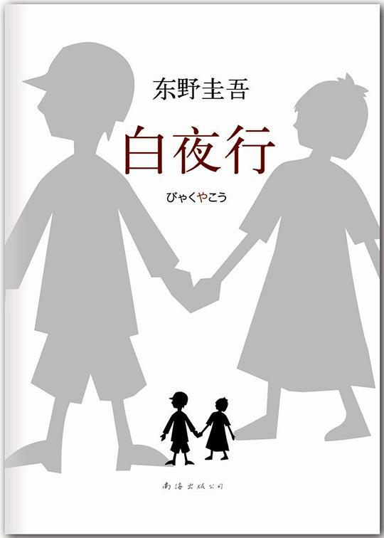 | 白夜行 | [日] 东野圭吾 | ★★★★★ | 2021-08-17 |  | [NeoDB](https://neodb.social/book/0oH2luJGCafZKSRnQjAArw) [豆瓣](https://book.douban.com/subject/10554308/) |
| 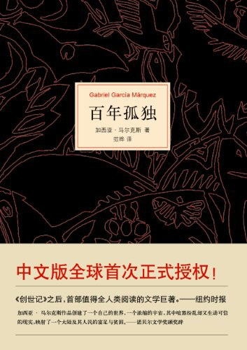 | 百年孤独 | [哥伦比亚] 加西亚·马尔克斯 | ★★★★☆ | 2021-08-17 | 2021.8.18 [全文](../reviews/book-6082808-百年孤独.md) | [NeoDB](https://neodb.social/book/4AD6dlBaI5GWtFEWsaPVYl) [豆瓣](https://book.douban.com/subject/6082808/) |
| 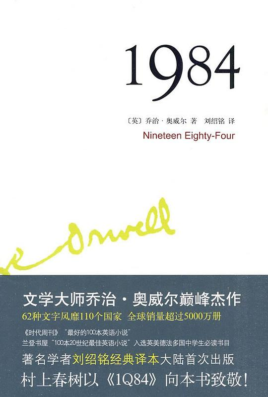 | 1984 | [英] 乔治·奥威尔 | ★★★★★ | 2021-08-17 |  | [NeoDB](https://neodb.social/book/5UZ10zBWMqkIVbzdc1zdVG) [豆瓣](https://book.douban.com/subject/4820710/) |
|  | 三体Ⅱ | 刘慈欣 | ★★★★★ | 2021-08-16 |  | [NeoDB](https://neodb.social/book/71YWWTuNgvwGndv8m8DEBu) [豆瓣](https://book.douban.com/subject/3066477/) |
| 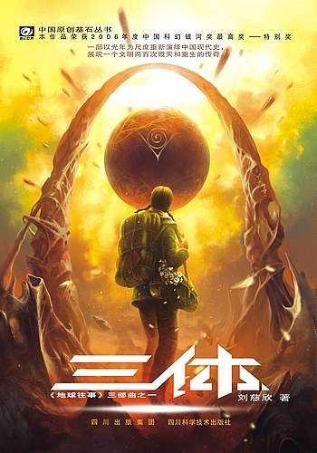 | 三体 | 刘慈欣 | ★★★★★ | 2018-12-02 | 把文革、游戏、未来结合在一起，不得不佩服 [全文](../reviews/book-2567698-三体.md) | [NeoDB](https://neodb.social/book/7OGqnJkxiQZImAxD9aAgMr) [豆瓣](https://book.douban.com/subject/2567698/) |
| [封面](https://img9.doubanio.com/view/subject/s/public/s26012674.jpg) | 三体Ⅲ | 刘慈欣 | ★★★★★ | 2018-12-02 | 说实话刘慈欣笔下的女性都写的不太好啊我觉得 [全文](../reviews/book-5363767-三体Ⅲ.md) | [NeoDB](https://neodb.social/book/5TOECyDkPh16BaEcz2eNgI) [豆瓣](https://book.douban.com/subject/5363767/) |
|  | 哈利·波特与魔法石 | [英] J. K. 罗琳 | ★★★★★ | 2018-12-02 |  | [NeoDB](https://neodb.social/book/2qqxjbLDSy8nA6KcFcIlUy) [豆瓣](https://book.douban.com/subject/1041007/) |
|  | 哈利·波特与凤凰社 | [英] J. K. 罗琳 | ★★★★☆ | 2018-12-02 | 翻译错误不少…… [全文](../reviews/book-1013129-哈利·波特与凤凰社.md) | [NeoDB](https://neodb.social/book/0JgKhiuVrepPZZmFLKyHrq) [豆瓣](https://book.douban.com/subject/1013129/) |
| 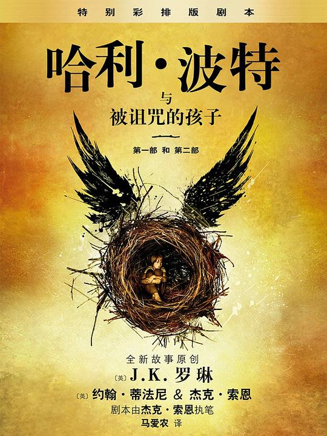 | 哈利·波特与被诅咒的孩子 | [英] 约翰·蒂法尼、杰克·索恩、J.K.罗琳 | ★★★★☆ | 2018-12-02 | 看到JK罗琳就立刻借来读完，但并不是那么好，有一点失望。 [全文](../reviews/book-26871656-哈利·波特与被诅咒的孩子.md) | [NeoDB](https://neodb.social/book/66F3PLycoKmiRHj2cMRHfJ) [豆瓣](https://book.douban.com/subject/26871656/) |
| 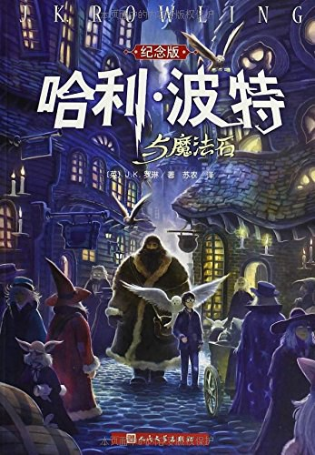 | 哈利·波特与魔法石（纪念版） | [英] J. K. 罗琳 | ★★★★★ | 2018-12-02 |  | [NeoDB](https://neodb.social/book/4s17W1Y2EcWb3FAbyir50i) [豆瓣](https://book.douban.com/subject/26126183/) |
|  | 哈利·波特与密室 | [英] J.K.罗琳 | ★★★★★ | 2018-12-02 |  | [NeoDB](https://neodb.social/book/6iwyN7Dp9ykD989IVxi0Rv) [豆瓣](https://book.douban.com/subject/26126497/) |
| 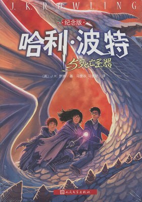 | 哈利·波特与死亡圣器 | [英] J. K. 罗琳 | ★★★★★ | 2018-12-02 |  | [NeoDB](https://neodb.social/book/0xgXnXiO8qL6vp5i34PIvS) [豆瓣](https://book.douban.com/subject/26126545/) |
| 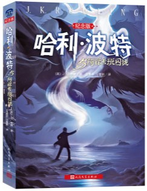 | 哈利·波特与阿兹卡班囚徒 | [英] J. K. 罗琳 | ★★★★★ | 2018-12-02 |  | [NeoDB](https://neodb.social/book/7OrpKUEMKaf3vGFkOxbEuC) [豆瓣](https://book.douban.com/subject/26126498/) |
| [封面](https://img9.doubanio.com/view/subject/s/public/s27614035.jpg) | 哈利·波特与火焰杯 | J.K.罗琳 | ★★★★★ | 2018-12-02 |  | [NeoDB](https://neodb.social/book/3Tdc8TKLk2JGynt0UjKmlG) [豆瓣](https://book.douban.com/subject/26126139/) |
| 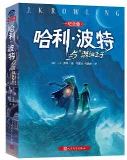 | 哈利·波特与"混血王子" | [英] J. K. 罗琳 | ★★★★★ | 2018-12-02 |  | [NeoDB](https://neodb.social/book/18NTVBcjW9MvN3LGl6Vrdr) [豆瓣](https://book.douban.com/subject/26126522/) |
| 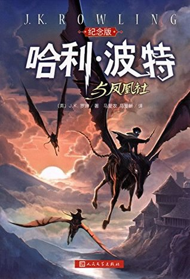 | 哈利·波特与凤凰社 | [英] J. K. 罗琳 | ★★★★☆ | 2018-12-02 |  | [NeoDB](https://neodb.social/book/4478oKuEHRBQGojB1TR4F8) [豆瓣](https://book.douban.com/subject/26126500/) |

## 想看（82）

| 封面 | 标题 | 作者/导演 | 评分 | 时间 | 短评 | 链接 |
|---|---|---|---|---|---|---|
| — | 米格尔街 | V.S.奈保尔 (V.S.Naipaul) | 未评分 | 2026-09-14 |  | [NeoDB](https://neodb.social/book/1aUnzR8EgYkXFJf5Ygn5nT) [豆瓣](https://book.douban.com/subject/21346008/) |
| 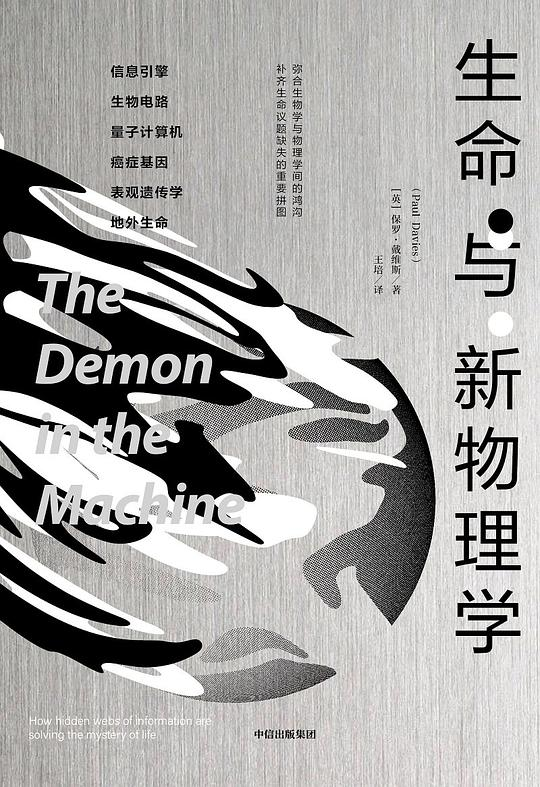 | 生命与新物理学 | 【英国】保罗·戴维斯（Paul Davies） | 未评分 | 2026-08-20 |  | [NeoDB](https://neodb.social/book/0qugApnNnC0KUhn2QrLy97) [豆瓣](https://book.douban.com/subject/33590444/) |
|  | 去吧，摩西 | [美] 威廉·福克纳 | 未评分 | 2026-05-27 |  | [NeoDB](https://neodb.social/book/2uX3YCfJZHV3VouXJZDrTU) [豆瓣](https://book.douban.com/subject/4618955/) |
| 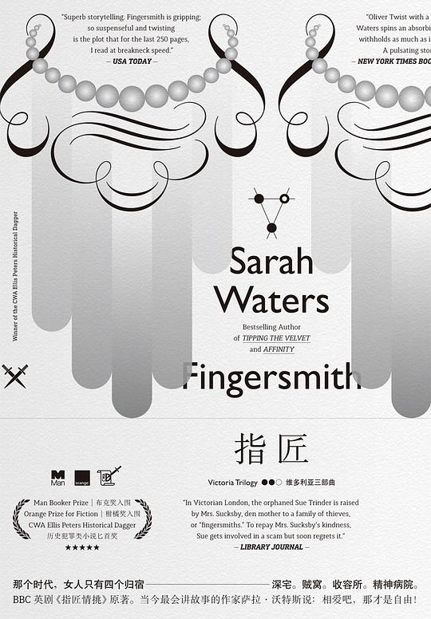 | 指匠 | [英] 萨拉·沃特斯 | 未评分 | 2026-04-01 |  | [NeoDB](https://neodb.social/book/3qHsZpvnxVVdumQ5zeWMGW) [豆瓣](https://book.douban.com/subject/26952166/) |
| 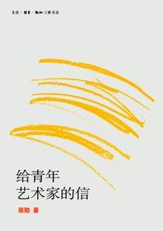 | 给青年艺术家的信 | 蒋勋 | 未评分 | 2025-11-17 |  | [NeoDB](https://neodb.social/book/3UcSw3sHt3Vry8GE9BQvNe) [豆瓣](https://book.douban.com/subject/3410833/) |
| 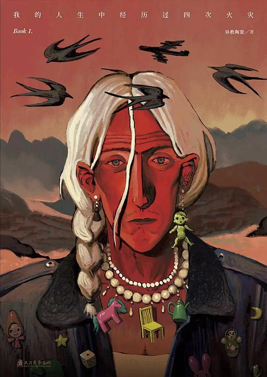 | 我的人生中经历过四次火灾 | 异教陶瓷 | 未评分 | 2025-07-24 |  | [NeoDB](https://neodb.social/book/2kSPZ9iHc9Erd8RKu5ddUy) [豆瓣](https://book.douban.com/subject/36882781/) |
| [封面](https://img9.doubanio.com/view/subject/s/public/s34289066.jpg) | 一句顶一万句 | 刘震云 | 未评分 | 2025-06-29 |  | [NeoDB](https://neodb.social/book/2fXCWIj4ogT1WkDRMJZ6nu) [豆瓣](https://book.douban.com/subject/36062390/) |
| 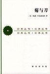 | 菊与刀 | [美]鲁思・本尼迪克特 | 未评分 | 2025-06-29 |  | [NeoDB](https://neodb.social/book/5mrxixI4T8bCd4HsObcXsO) [豆瓣](https://book.douban.com/subject/1022238/) |
| [封面](https://img9.doubanio.com/view/subject/s/public/s29529746.jpg) | 南方高速 | [阿根廷] 胡里奥·科塔萨尔 | 未评分 | 2025-05-14 |  | [NeoDB](https://neodb.social/book/2Qg1MtMhwKMuyCeLB9Llkg) [豆瓣](https://book.douban.com/subject/27079479/) |
| 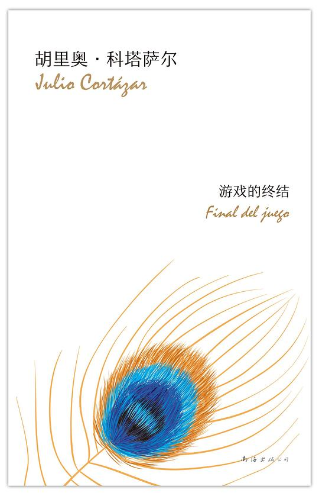 | 游戏的终结 | [阿根廷] 胡里奥·科塔萨尔 | 未评分 | 2025-05-14 |  | [NeoDB](https://neodb.social/book/2Ydfp2KzMJ2aNJOqEaPgYZ) [豆瓣](https://book.douban.com/subject/34786083/) |
| 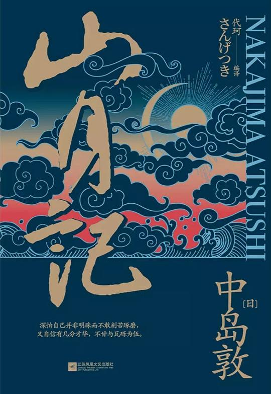 | 山月记 | [日] 中岛敦 | 未评分 | 2025-05-05 |  | [NeoDB](https://neodb.social/book/7EJo2pNiRePCjRlHwl25K9) [豆瓣](https://book.douban.com/subject/34795345/) |
| [封面](https://img9.doubanio.com/view/subject/s/public/s34705784.jpg) | 世上为什么要有图书馆 | 杨素秋 | 未评分 | 2024-12-28 |  | [NeoDB](https://neodb.social/book/09ptOap3jdga56GrqyUJvk) [豆瓣](https://book.douban.com/subject/36593622/) |
| [封面](https://img9.doubanio.com/view/subject/s/public/s34711695.jpg) | 卡拉马佐夫兄弟 | [俄]陀思妥耶夫斯基 | 未评分 | 2024-05-06 |  | [NeoDB](https://neodb.social/book/6LAanHwOWpVy5UQLHfV6If) [豆瓣](https://book.douban.com/subject/25887924/) |
| 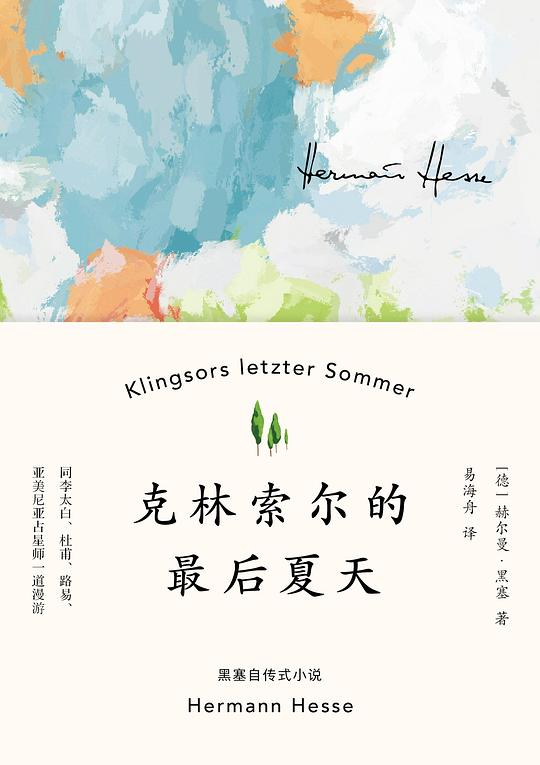 | 克林索尔的最后夏天 | [德] 赫尔曼·黑塞 | 未评分 | 2024-04-19 |  | [NeoDB](https://neodb.social/book/4WMMz3OmKk0Z2Oxfewxc6Y) [豆瓣](https://book.douban.com/subject/30389968/) |
| 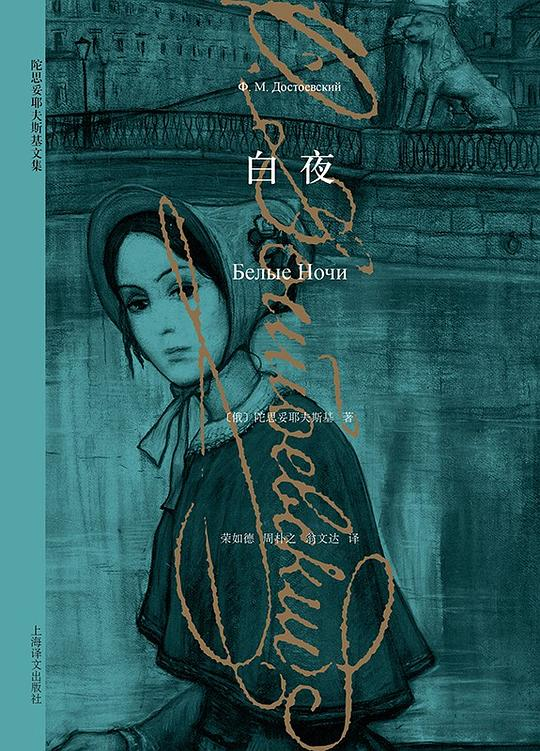 | 白夜 | [俄] 陀思妥耶夫斯基 | 未评分 | 2024-03-24 |  | [NeoDB](https://neodb.social/book/2Z2QQuTiW8tEzw10HDG8Uk) [豆瓣](https://book.douban.com/subject/25887921/) |
| 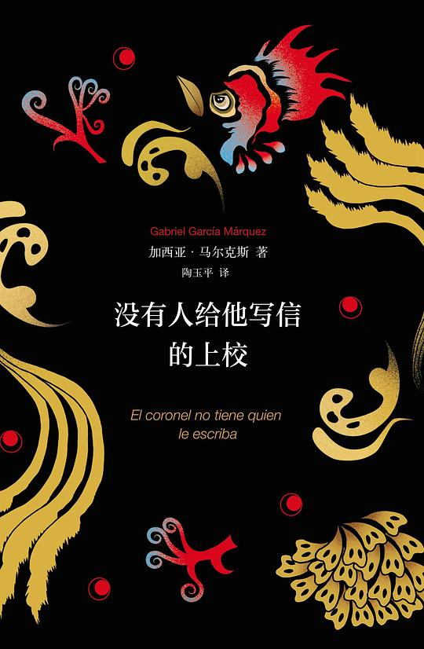 | 没有人给他写信的上校 | [哥伦比亚]加西亚·马尔克斯 | 未评分 | 2024-03-24 |  | [NeoDB](https://neodb.social/book/2x1d1tDLF8ecHJf4jQQsFh) [豆瓣](https://book.douban.com/subject/30177172/) |
| 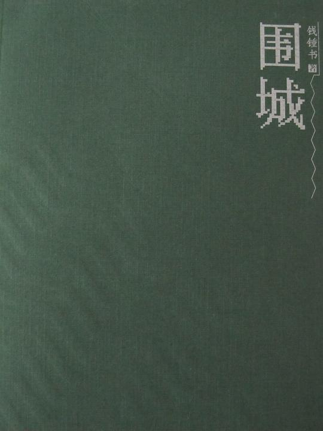 | 围城 | 钱锺书 | 未评分 | 2023-07-30 |  | [NeoDB](https://neodb.social/book/0f0bNxItmcoiQmnnYSwKpD) [豆瓣](https://book.douban.com/subject/1855364/) |
| [封面](https://img9.doubanio.com/view/subject/s/public/s27185176.jpg) | 青铜时代 | 王小波 | 未评分 | 2023-07-30 |  | [NeoDB](https://neodb.social/book/0oizm0G7H3PgRkwjPUAZTV) [豆瓣](https://book.douban.com/subject/1436713/) |
| 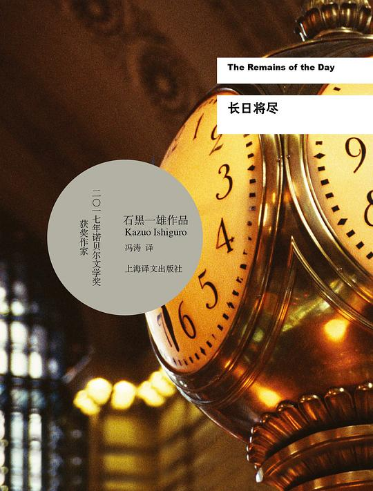 | 长日将尽 | [英] 石黑一雄 | 未评分 | 2023-07-25 |  | [NeoDB](https://neodb.social/book/63Y5Oh76ps65aUVnkkt4KS) [豆瓣](https://book.douban.com/subject/30142261/) |
| [封面](https://img9.doubanio.com/view/subject/s/public/s8968135.jpg) | 树上的男爵 | [意大利]伊塔洛·卡尔维诺 | 未评分 | 2023-06-19 |  | [NeoDB](https://neodb.social/book/5XBovHi376d5lmBNgb0izd) [豆瓣](https://book.douban.com/subject/6789605/) |
| 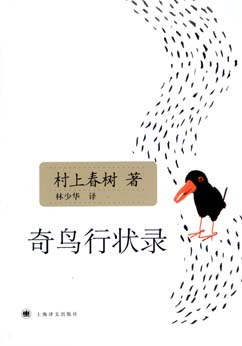 | 奇鸟行状录 | 村上春树 | 未评分 | 2023-03-30 |  | [NeoDB](https://neodb.social/book/5fMqvfWhKPXsEw8twYz5JY) [豆瓣](https://book.douban.com/subject/3928882/) |
| 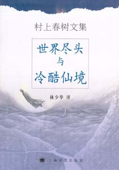 | 世界尽头与冷酷仙境 | [日] 村上春树 | 未评分 | 2023-03-30 |  | [NeoDB](https://neodb.social/book/2m96ZHuoibS0JDHMdwFSnf) [豆瓣](https://book.douban.com/subject/1291809/) |
| [封面](https://img9.doubanio.com/view/subject/s/public/s2857294.jpg) | 查拉图斯特拉如是说 | [德] 尼采 | 未评分 | 2023-02-26 |  | [NeoDB](https://neodb.social/book/38crXITCgfazhcLnNV1Gxv) [豆瓣](https://book.douban.com/subject/2359052/) |
|  | 围城 | 钱锺书 | 未评分 | 2023-02-26 |  | [NeoDB](https://neodb.social/book/2PS3wdgXV2YKhD504tCi4U) [豆瓣](https://book.douban.com/subject/11524204/) |
|  | 人生海海 | 麦家 | 未评分 | 2023-02-26 |  | [NeoDB](https://neodb.social/book/45sIM7b0laL0fVcS9yKiG7) [豆瓣](https://book.douban.com/subject/30475767/) |
|  | 82年生的金智英 | [韩]赵南柱 | 未评分 | 2023-01-31 |  | [NeoDB](https://neodb.social/book/3iQ28GlfMnNLgXpgHKA0I6) [豆瓣](https://book.douban.com/subject/34434309/) |
| [封面](https://img9.doubanio.com/view/subject/s/public/s34387186.jpg) | We Live in Nanjing (2 Books) | 天瑞说符 | 未评分 | 2023-01-28 |  | [NeoDB](https://neodb.social/book/3DNAYNZMpEus5Rf1L25p7Z) [豆瓣](https://book.douban.com/subject/36126737/) |
| 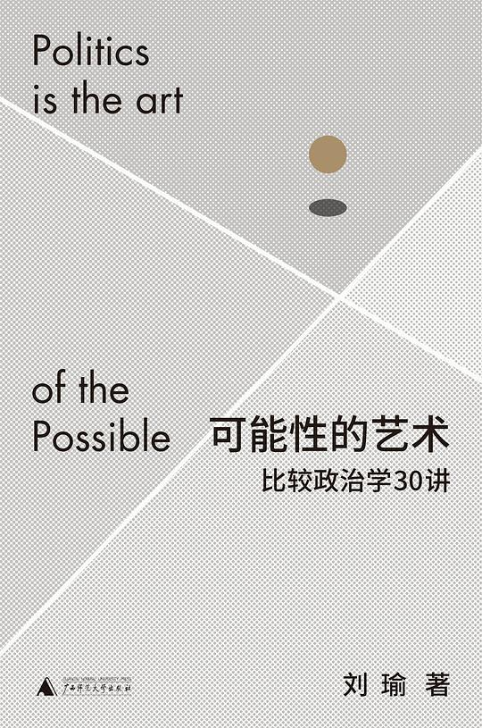 | 可能性的艺术 | 刘瑜 | 未评分 | 2022-12-20 |  | [NeoDB](https://neodb.social/book/1pL6amHeATn0Y56EIa2puT) [豆瓣](https://book.douban.com/subject/35819419/) |
| 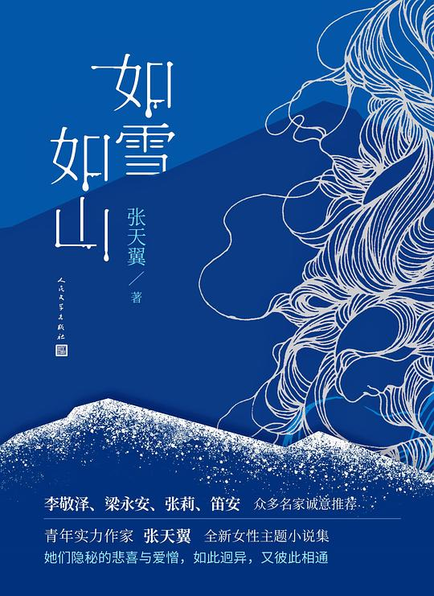 | 如雪如山 | 张天翼 | 未评分 | 2022-12-20 |  | [NeoDB](https://neodb.social/book/7MFDYdImcjvqqREhXHKrws) [豆瓣](https://book.douban.com/subject/35875393/) |
|  | 折断的龙骨（全2册） | [日] 米泽穗信 | 未评分 | 2022-07-03 |  | [NeoDB](https://neodb.social/book/4lM2HBEuSPYqZU7J2eyW7x) [豆瓣](https://book.douban.com/subject/27621482/) |
| [封面](https://img9.doubanio.com/view/subject/s/public/s1230936.jpg) | 神奇动物在哪里 | [英] 纽特·斯卡曼 | 未评分 | 2022-02-02 |  | [NeoDB](https://neodb.social/book/0OhUpDC2lP5MGLuzkEEPGb) [豆瓣](https://book.douban.com/subject/1028779/) |
| 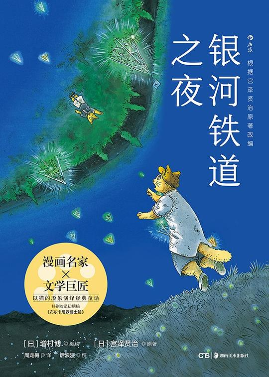 | 银河铁道之夜 | [日] 宫泽贤治 原著、[日] 增村博 编绘 | 未评分 | 2022-02-02 |  | [NeoDB](https://neodb.social/book/6pPXD1WVHwGxevJYqDGhe3) [豆瓣](https://book.douban.com/subject/30237190/) |
|  | 伊卡狛格 | [英] J·K·罗琳 | 未评分 | 2022-02-02 |  | [NeoDB](https://neodb.social/book/6soVnBAV6G94ewTqLqzVU3) [豆瓣](https://book.douban.com/subject/35228043/) |
| 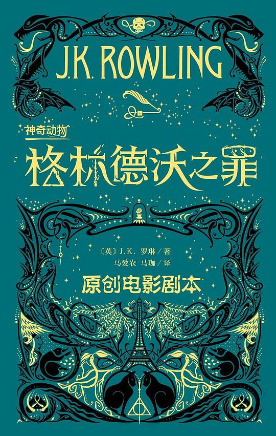 | 神奇动物：格林德沃之罪 | [英] J·K·罗琳 | 未评分 | 2022-02-02 |  | [NeoDB](https://neodb.social/book/4G1IhF0vIgXXNkWNDqatYJ) [豆瓣](https://book.douban.com/subject/30368773/) |
| [封面](https://img9.doubanio.com/view/subject/s/public/s1310545.jpg) | 神奇的魁地奇球 | [英] 肯尼沃思·惠斯普 | 未评分 | 2022-02-02 |  | [NeoDB](https://neodb.social/book/4DwNNTy5vIH6JO2lu0pNjx) [豆瓣](https://book.douban.com/subject/1084341/) |
|  | 偶发空缺 | [英] J. K. 罗琳 | 未评分 | 2022-02-02 |  | [NeoDB](https://neodb.social/book/1WQ1BTqLSWgj6LUWELtqH4) [豆瓣](https://book.douban.com/subject/19898714/) |
| 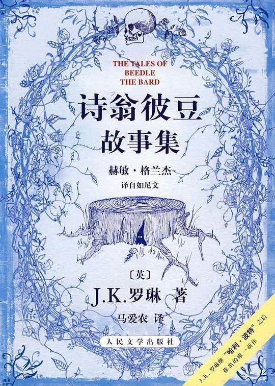 | 诗翁彼豆故事集 | [英] J. K. 罗琳 | 未评分 | 2022-02-02 |  | [NeoDB](https://neodb.social/book/6JJaAUQdLNbujSWQV0PIc9) [豆瓣](https://book.douban.com/subject/3338175/) |
|  | 岩波日本史（全九卷） | [英] J.K.罗琳 著、[英] 吉姆·菲尔德 绘 | 未评分 | 2022-02-02 |  | [NeoDB](https://neodb.social/book/6VsBSp62Jqm0qyDh36gHvQ) [豆瓣](https://book.douban.com/subject/35096293/) |
| [封面](https://img9.doubanio.com/view/subject/s/public/s34076076.jpg) | 我能有什么坏心思呢 | 乔舒亚·巴克曼（Joshua Barkman） | 未评分 | 2022-01-22 |  | [NeoDB](https://neodb.social/book/2LxfkUPgsbJweUA4Izd6Ob) [豆瓣](https://book.douban.com/subject/35632117/) |
| [封面](https://img9.doubanio.com/view/subject/s/public/s5689155.jpg) | 中国手语（上下修订版） | 中国聋人协会 编 | 未评分 | 2022-01-10 |  | [NeoDB](https://neodb.social/book/3f3n59VhNJlpylay72y5NE) [豆瓣](https://book.douban.com/subject/1215103/) |
| 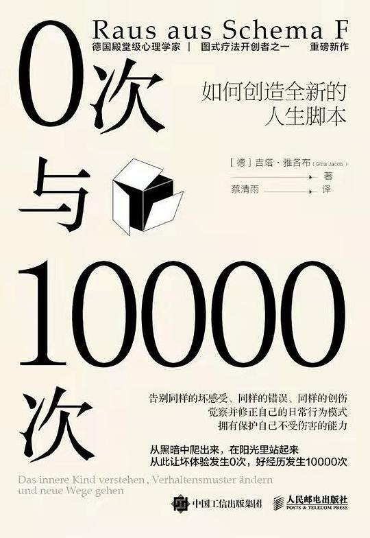 | 0次与10000次 | [德] 吉塔·雅各布 | 未评分 | 2021-12-30 |  | [NeoDB](https://neodb.social/book/4O38sbSc6qMYMbHtCISaKR) [豆瓣](https://book.douban.com/subject/35602271/) |
| [封面](https://img9.doubanio.com/view/subject/s/public/s33821754.jpg) | 克拉拉与太阳 | [英] 石黑一雄 | 未评分 | 2021-12-22 |  | [NeoDB](https://neodb.social/book/1GNhgqY0S8mo936zDDJtCS) [豆瓣](https://book.douban.com/subject/35315153/) |
| 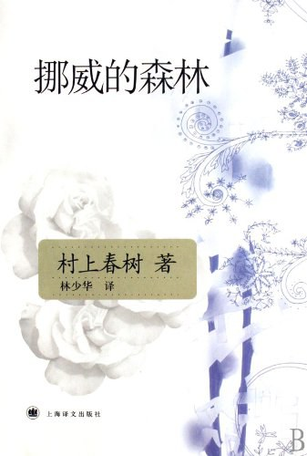 | 挪威的森林 | [日] 村上春树 | 未评分 | 2021-12-10 |  | [NeoDB](https://neodb.social/book/5qfwYUbJAsJ88MH78jm7bW) [豆瓣](https://book.douban.com/subject/2159042/) |
| 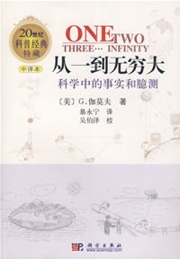 | 从一到无穷大 | [美] G. 伽莫夫、[美国] 乔治·伽莫夫 | 未评分 | 2021-12-10 |  | [NeoDB](https://neodb.social/book/4jee4WNqTpySShkhR7UxoN) [豆瓣](https://book.douban.com/subject/1102715/) |
|  | 哈姆莱特 | [英] 莎士比亚 | 未评分 | 2021-12-10 |  | [NeoDB](https://neodb.social/book/0yFIuNZwsggNyZHHptWn6B) [豆瓣](https://book.douban.com/subject/1006197/) |
| [封面](https://img9.doubanio.com/view/subject/s/public/s6776106.jpg) | 娱乐至死 | [美] 尼尔·波兹曼 | 未评分 | 2021-12-10 |  | [NeoDB](https://neodb.social/book/4qM057PsWwsM1RSCt1uLlz) [豆瓣](https://book.douban.com/subject/1062193/) |
|  | 世界的凛冬 | [英] 肯·福莱特 | 未评分 | 2021-12-10 |  | [NeoDB](https://neodb.social/book/7X6ZAYMujQHSQIX400cmAl) [豆瓣](https://book.douban.com/subject/26957760/) |
| 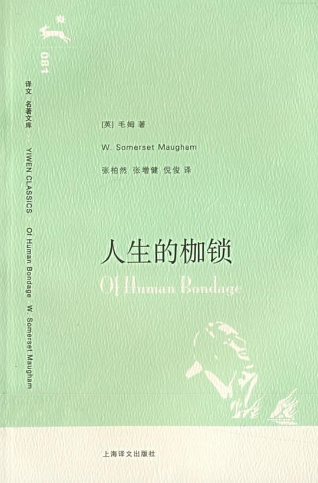 | 人生的枷锁 | [英] 毛姆 | 未评分 | 2021-12-10 |  | [NeoDB](https://neodb.social/book/3bjfE05Sfk3QFSkN8Q9V4F) [豆瓣](https://book.douban.com/subject/2035171/) |
| 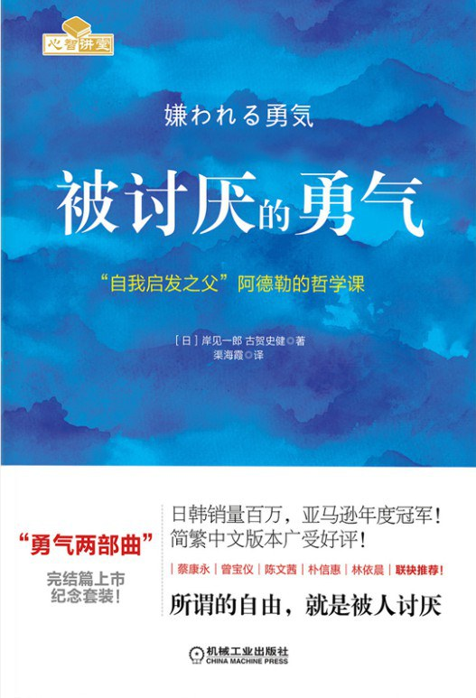 | 被讨厌的勇气 | [日] 岸见一郎、[日] 古贺史健 | 未评分 | 2021-12-10 | 沃玛（小声 [全文](../reviews/book-26369699-被讨厌的勇气.md) | [NeoDB](https://neodb.social/book/5HxoiagR3TO2vRHDIYqhky) [豆瓣](https://book.douban.com/subject/26369699/) |
| [封面](https://img9.doubanio.com/view/subject/s/public/s4355925.jpg) | 拖延心理学 | [美] 简·博克(Jane B. Burka)、[美] 莱诺拉·袁(Lenora M. Yuen) | 未评分 | 2021-12-10 |  | [NeoDB](https://neodb.social/book/6E7PRgpjQhqkia5Bu9MASW) [豆瓣](https://book.douban.com/subject/4180711/) |
|  | 飘 | [美] 玛格丽特·米切尔 | 未评分 | 2021-12-10 |  | [NeoDB](https://neodb.social/book/3KwHhIdb0bYWXc4yC0KlSU) [豆瓣](https://book.douban.com/subject/1068920/) |
| 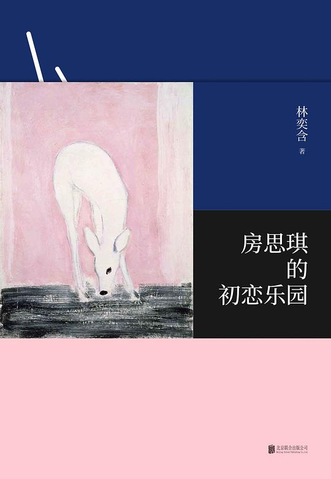 | 房思琪的初恋乐园 | 林奕含 | 未评分 | 2021-12-10 |  | [NeoDB](https://neodb.social/book/5CGshKXr2IRnVoQQ62fdOz) [豆瓣](https://book.douban.com/subject/27614904/) |
| 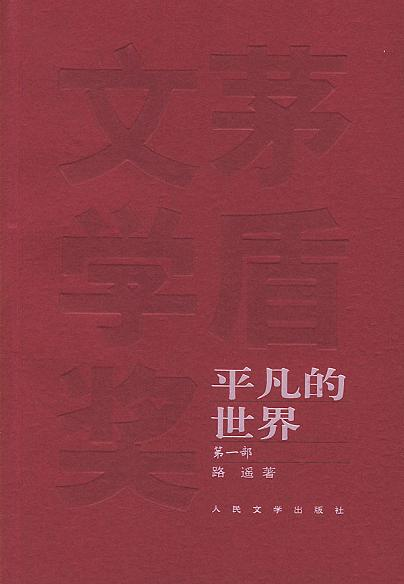 | 平凡的世界（全三部） | 路遥 | 未评分 | 2021-12-10 |  | [NeoDB](https://neodb.social/book/05BjmGAd4VFzmMULI7dBZf) [豆瓣](https://book.douban.com/subject/1200840/) |
| 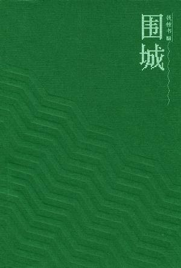 | 围城 | 钱锺书 | 未评分 | 2021-12-10 |  | [NeoDB](https://neodb.social/book/1O2H07cxKiEKkNA0vdk2l7) [豆瓣](https://book.douban.com/subject/1008145/) |
| [封面](https://img9.doubanio.com/view/subject/s/public/s3745215.jpg) | 明朝那些事儿（1-9） | 当年明月 | 未评分 | 2021-12-10 |  | [NeoDB](https://neodb.social/book/319vl6IGR6CsvSSYwDW7Xv) [豆瓣](https://book.douban.com/subject/3674537/) |
| 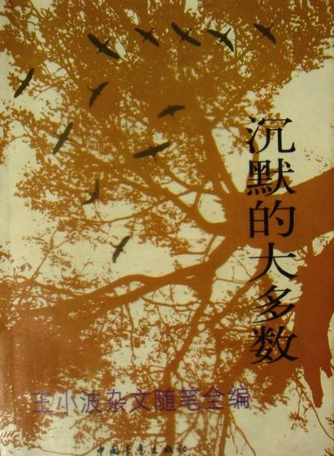 | 沉默的大多数 | 王小波 | 未评分 | 2021-12-10 |  | [NeoDB](https://neodb.social/book/7Kq0ufmFgg64w4ST5b9EAS) [豆瓣](https://book.douban.com/subject/1054685/) |
| 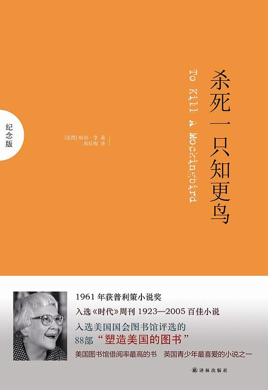 | 杀死一只知更鸟 | [美] 哈珀·李 | 未评分 | 2021-12-10 |  | [NeoDB](https://neodb.social/book/5w5QhmMpQNE1eGMqLL5ACG) [豆瓣](https://book.douban.com/subject/6781808/) |
| [封面](https://img9.doubanio.com/view/subject/s/public/s1800355.jpg) | 万历十五年 | [美] 黄仁宇 | 未评分 | 2021-12-10 |  | [NeoDB](https://neodb.social/book/3NWo7SIi7eYwsqVcD47iV9) [豆瓣](https://book.douban.com/subject/1041482/) |
| 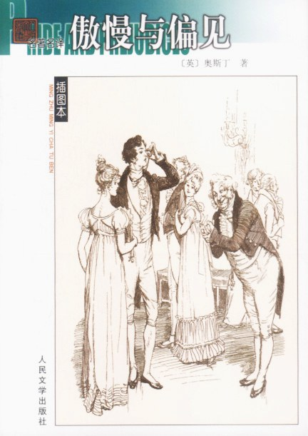 | 傲慢与偏见 | [英] 奥斯丁 | 未评分 | 2021-12-10 |  | [NeoDB](https://neodb.social/book/4qHXhRXCo8Ypay4I0cgsMk) [豆瓣](https://book.douban.com/subject/1083428/) |
|  | 刀锋 | [英] 毛姆 | 未评分 | 2021-12-10 |  | [NeoDB](https://neodb.social/book/0ovUdsFefNqtlh2CJ1yjT2) [豆瓣](https://book.douban.com/subject/2035162/) |
| 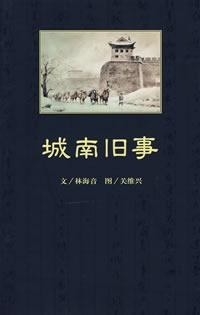 | 城南旧事 | 林海音 文、关维兴 图 | 未评分 | 2021-12-10 |  | [NeoDB](https://neodb.social/book/4RrigwbEKvy4h8V2GpO1Ue) [豆瓣](https://book.douban.com/subject/1254588/) |
| [封面](https://img9.doubanio.com/view/subject/s/public/s4521754.jpg) | 悲惨世界（上中下） | [法] 雨果 | 未评分 | 2021-12-10 |  | [NeoDB](https://neodb.social/book/3aYEaBtlTGi1H6vGpj1ERt) [豆瓣](https://book.douban.com/subject/1205054/) |
| [封面](https://img9.doubanio.com/view/subject/s/public/s1486674.jpg) | 上帝掷骰子吗 | 曹天元 | 未评分 | 2021-12-10 |  | [NeoDB](https://neodb.social/book/7OL7UlOW3RX8lrHuVkfHH1) [豆瓣](https://book.douban.com/subject/1467022/) |
| 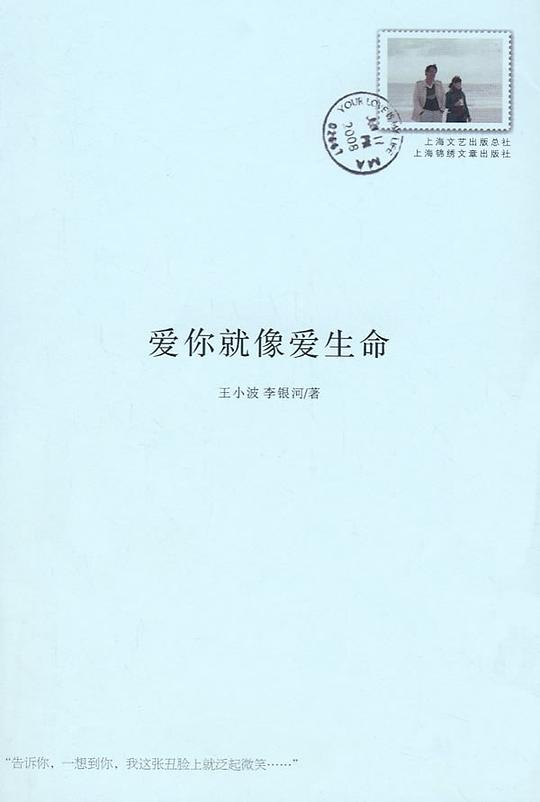 | 爱你就像爱生命 | 王小波、李银河 | 未评分 | 2021-12-10 |  | [NeoDB](https://neodb.social/book/0uWFJ54ytLPh6Y3wQgPb2V) [豆瓣](https://book.douban.com/subject/3071717/) |
| 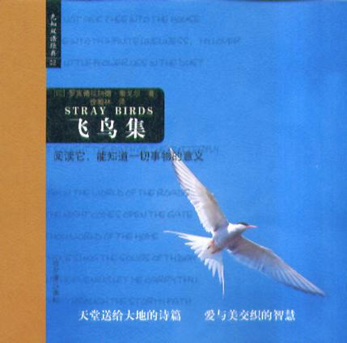 | 飞鸟集 | [印] 罗宾德拉纳德·泰戈尔 | 未评分 | 2021-12-10 |  | [NeoDB](https://neodb.social/book/0IMIjSWRtz7XHqw3txmVRK) [豆瓣](https://book.douban.com/subject/1058661/) |
|  | 边城 | 沈从文 | 未评分 | 2021-12-10 |  | [NeoDB](https://neodb.social/book/2Jlum3V13WssmE4wuP9196) [豆瓣](https://book.douban.com/subject/1057244/) |
|  | 教父 | [美]马里奥·普佐 | 未评分 | 2021-12-10 |  | [NeoDB](https://neodb.social/book/5hTMoRGXNFWjZ10qegWtKx) [豆瓣](https://book.douban.com/subject/1092335/) |
| 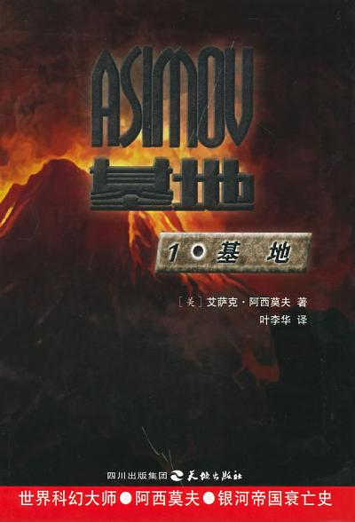 | 基地 | [美] 艾萨克·阿西莫夫 | 未评分 | 2021-12-10 |  | [NeoDB](https://neodb.social/book/2NV41biyW1GdnGg9lltNPP) [豆瓣](https://book.douban.com/subject/1258490/) |
| [封面](https://img9.doubanio.com/view/subject/s/public/s28668834.jpg) | 巨人的陨落 | [英] 肯·福莱特 | 未评分 | 2021-12-10 |  | [NeoDB](https://neodb.social/book/3rfmQwOG82Srj2zWkcQrJ0) [豆瓣](https://book.douban.com/subject/26698660/) |
|  | 海子的诗 | 海子 | 未评分 | 2021-12-10 |  | [NeoDB](https://neodb.social/book/712m4QU7COzgaKJ0SspCSG) [豆瓣](https://book.douban.com/subject/1011754/) |
| 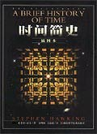 | 时间简史 | [英] 史蒂芬·霍金 | 未评分 | 2021-12-10 |  | [NeoDB](https://neodb.social/book/18sVsE1V1Y9snGRjGPBUql) [豆瓣](https://book.douban.com/subject/1034282/) |
| 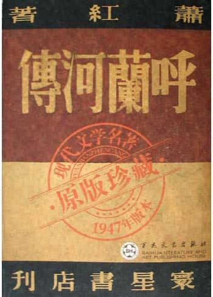 | 呼兰河传 | 萧红 | 未评分 | 2021-12-10 |  | [NeoDB](https://neodb.social/book/1hWgk9Bs0f03RmPmeF5OYJ) [豆瓣](https://book.douban.com/subject/1060852/) |
|  | 最好的告别 | [美] 阿图·葛文德（Atul Gawande） | 未评分 | 2021-12-10 |  | [NeoDB](https://neodb.social/book/2cjV88W2Ks6veDpVL1q6cB) [豆瓣](https://book.douban.com/subject/26576861/) |
|  | 一个叫欧维的男人决定去死 | [瑞典] 弗雷德里克·巴克曼 | 未评分 | 2021-12-10 |  | [NeoDB](https://neodb.social/book/0xV0fRBCA0bmGjeP9lTFox) [豆瓣](https://book.douban.com/subject/26672693/) |
| 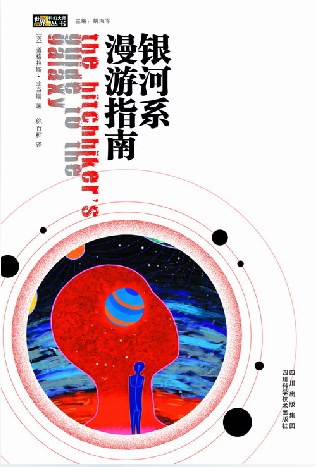 | 银河系漫游指南 | [英] 道格拉斯·亚当斯 | 未评分 | 2021-12-10 |  | [NeoDB](https://neodb.social/book/5aJQ1oAREoxYQWU7bj77L2) [豆瓣](https://book.douban.com/subject/1394364/) |
| 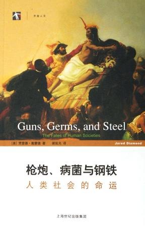 | 枪炮、病菌与钢铁 | [美] 贾雷德·戴蒙德 | 未评分 | 2021-12-10 |  | [NeoDB](https://neodb.social/book/2C2KyyhtZb9tMPE4AwyxhA) [豆瓣](https://book.douban.com/subject/1813841/) |
| 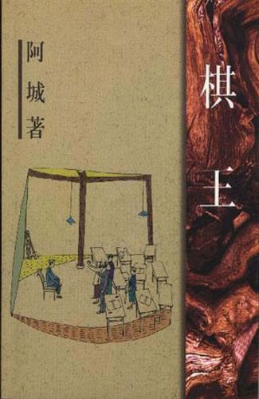 | 棋王 | 阿城 | 未评分 | 2021-12-10 |  | [NeoDB](https://neodb.social/book/4WsD7B1kUXJeazkdVi6Oib) [豆瓣](https://book.douban.com/subject/1020961/) |
| 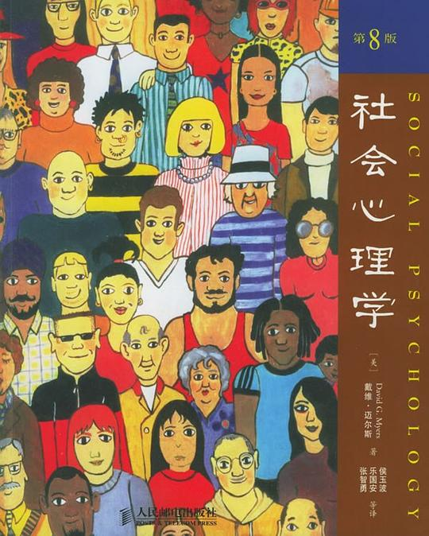 | 社会心理学 | [美] 戴维·迈尔斯 | 未评分 | 2021-12-10 |  | [NeoDB](https://neodb.social/book/6ZUzqpLf39gaaqWcS3Ef4l) [豆瓣](https://book.douban.com/subject/1476651/) |
|  | 顾城的诗 | 顾城 | 未评分 | 2021-12-10 |  | [NeoDB](https://neodb.social/book/5CyyRlmrlEIcW3OcSSBXU4) [豆瓣](https://book.douban.com/subject/1033825/) |
| [封面](https://img9.doubanio.com/view/subject/s/public/s26720726.jpg) | 最好的我们 | 八月长安 | 未评分 | 2021-12-10 |  | [NeoDB](https://neodb.social/book/6WNmoSuJxtpHqGxviHawMZ) [豆瓣](https://book.douban.com/subject/24754316/) |
| 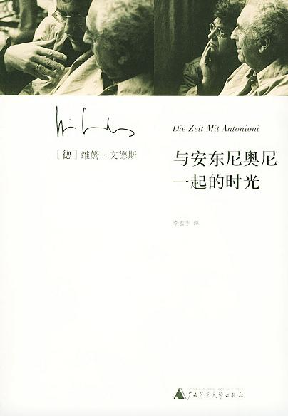 | 与安东尼奥尼一起的时光 | 维姆·文德斯 | 未评分 | 2021-11-27 |  | [NeoDB](https://neodb.social/book/0lEVHl5lxq2R4ucAOPA1Ah) [豆瓣](https://book.douban.com/subject/1016806/) |
| 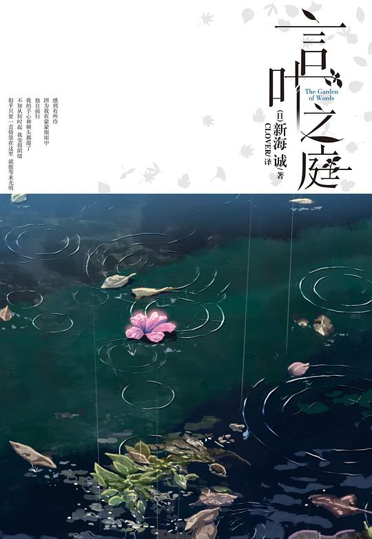 | 言叶之庭 | [日] 新海诚 | 未评分 | 2021-08-21 |  | [NeoDB](https://neodb.social/book/6ZoCsNh6vgeLdSl8T620jy) [豆瓣](https://book.douban.com/subject/26314932/) |
