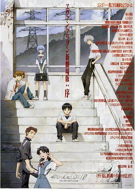
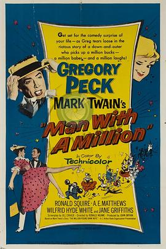
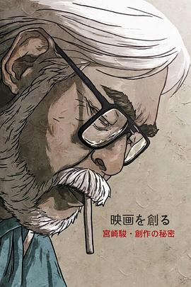
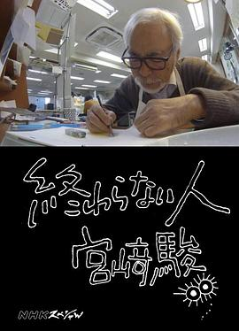

# 影

共 158（看过 73 / 想看 85）

## 看过（73）

| 封面 | 标题 | 作者/导演 | 评分 | 时间 | 短评 | 链接 |
|---|---|---|---|---|---|---|
|  | 夏日幽灵 | loundraw | ★★☆☆☆ | 2026-06-20 | 闲着没事翻有什么可以看的 才发现这部电影居然只有四十分钟 之前也听过配乐 于是看了 [全文](../reviews/movie-35368245-夏日幽灵.md) | [NeoDB](https://neodb.social/movie/1AxUFeaDV4H5N5IcwtWnFk) [豆瓣](https://movie.douban.com/subject/35368245/) |
|  | 白箱剧场版 | 水岛努 | ★★★☆☆ | 2026-06-18 | 失望 [全文](../reviews/movie-30207998-白箱剧场版.md) | [NeoDB](https://neodb.social/movie/2Ff9EIa95mO2huHIEH35cK) [豆瓣](https://movie.douban.com/subject/30207998/) |
| [封面](https://img9.doubanio.com/view/photo/s_ratio_poster/public/p2882098775.jpg) | 奇异世界 | 唐·霍尔、阮基 | 未评分 | 2026-05-15 | 补标，当时应该是看完了 [全文](../reviews/movie-35018488-奇异世界.md) | [NeoDB](https://neodb.social/movie/663Gu3KlrQArAfC574vbvk) [豆瓣](https://movie.douban.com/subject/35018488/) |
| [封面](https://img9.doubanio.com/view/photo/s_ratio_poster/public/p649141235.jpg) | 关于莉莉周的一切 | 岩井俊二 | ★★★☆☆ | 2026-05-15 | 很讨厌。没有对上电波。 [全文](../reviews/movie-1292219-关于莉莉周的一切.md) | [NeoDB](https://neodb.social/movie/7jpkuuGTX6Bn2stDQdPYyB) [豆瓣](https://movie.douban.com/subject/1292219/) |
|  | 的士速递5 | 弗兰克·盖思堂彼得 | 未评分 | 2026-02-14 | 很久之前在电视上看过 [全文](../reviews/movie-27615564-的士速递5.md) | [NeoDB](https://neodb.social/movie/6D1PGu699aqZWUvEtRZRQ1) [豆瓣](https://movie.douban.com/subject/27615564/) |
|  | 搏击俱乐部 | 大卫·芬奇 | ★★★★★ | 2026-01-31 | 2月1日16:31:17在家 [全文](../reviews/movie-1292000-搏击俱乐部.md) | [NeoDB](https://neodb.social/movie/33LWgbD3AIK7K8wSxAhtTp) [豆瓣](https://movie.douban.com/subject/1292000/) |
| [封面](https://img9.doubanio.com/view/photo/s_ratio_poster/public/p2928772586.jpg) | 超时空辉夜姬 | 山下清悟 | ★★★☆☆ | 2026-01-28 | 实在看的没有什么感觉，剧情哪哪似乎都差那么一点，跳出观众的视角来看能感觉作者想讲很多东西，寿命论，家庭，追求梦想，但是看… [全文](../reviews/movie-37825206-超时空辉夜姬.md) | [NeoDB](https://neodb.social/movie/3kKxQBRSQcUI7ad7Y58fIM) [豆瓣](https://movie.douban.com/subject/37825206/) |
|  | 我怎么可能成为你的恋人，不行不行！（※不是不可能！？） 剧场版 | 内沼菜摘 | ★★★☆☆ | 2026-01-01 | 我在看什么 [全文](../reviews/movie-37560609-我怎么可能成为你的恋人，不行不行！（※不是不可能！？）-.md) | [NeoDB](https://neodb.social/movie/7X8ORDDXGsiUkk0mkKDJoQ) [豆瓣](https://movie.douban.com/subject/37560609/) |
| — | 电锯人 - 剧场版：蕾塞篇 | /person/3w5mgvyeOIOWNaOshEbMnX | ★★★★★ | 2025-12-18 | 12月19日21:15:24 [全文](../reviews/movie-36691530-电锯人-剧场版：蕾塞篇.md) | [NeoDB](https://neodb.social/movie/5NAjaDqAgZeZ3ZzzPAkYEW) [豆瓣](https://movie.douban.com/subject/36691530/) |
|  | 疯狂动物城2 | 杰拉德·布什、拜伦·霍华德 | ★★★☆☆ | 2025-11-29 | 11月30日18:39:27ysx生日 [全文](../reviews/movie-26817136-疯狂动物城2.md) | [NeoDB](https://neodb.social/movie/3c1kyDKUvemvvxWRAKVAt6) [豆瓣](https://movie.douban.com/subject/26817136/) |
|  | 剧场总集篇 『孤独摇滚！』 Re:Re: | 斋藤圭一郎 | ★★★★★ | 2025-05-02 | 5月3日20:30:06在宿舍 [全文](../reviews/movie-36613553-剧场总集篇-『孤独摇滚！』-Re-Re.md) | [NeoDB](https://neodb.social/movie/2OZY3PuhyBar8Os53mFvsK) [豆瓣](https://movie.douban.com/subject/36613553/) |
|  | 剧场总集篇 『孤独摇滚！』 Re: | 斋藤圭一郎 | ★★★★★ | 2025-04-26 | 剪的一般，拍照那段放ppt难绷 [全文](../reviews/movie-36415357-剧场总集篇-『孤独摇滚！』-Re.md) | [NeoDB](https://neodb.social/movie/0jp4OnkuXk8b0abwW4Anea) [豆瓣](https://movie.douban.com/subject/36415357/) |
|  | 大佛普拉斯 | 黄信尧 | ★★★★★ | 2025-03-04 | 没有去上大物，看完了 [全文](../reviews/movie-27059130-大佛普拉斯.md) | [NeoDB](https://neodb.social/movie/2r0tdYNi9CW69JXlsgDiS8) [豆瓣](https://movie.douban.com/subject/27059130/) |
| [封面](https://img9.doubanio.com/view/photo/s_ratio_poster/public/p2558022335.jpg) | 天气之子 | 新海诚 | ★★★★☆ | 2025-02-17 | 2月18日17:09:57 [全文](../reviews/movie-30402296-天气之子.md) | [NeoDB](https://neodb.social/movie/3ULeoeK0CuJHa1h2bt7ZeK) [豆瓣](https://movie.douban.com/subject/30402296/) |
|  | 星际穿越 | 克里斯托弗·诺兰 | ★★★★★ | 2025-01-25 | 1月26日21:51:43 [全文](../reviews/movie-1889243-星际穿越.md) | [NeoDB](https://neodb.social/movie/2vE4NFmmigU2ofsivNOdcG) [豆瓣](https://movie.douban.com/subject/1889243/) |
|  | 蓦然回首 | 押山清高 | ★★★★★ | 2024-10-25 |  | [NeoDB](https://neodb.social/movie/2U8yMOgmiYTtZdxyvrCmBU) [豆瓣](https://movie.douban.com/subject/36765646/) |
|  | 天空之城 | 宫崎骏 | ★★★★★ | 2024-02-14 | 不同的人为了不同的目的去寻找天空之城，最终天空之城却飞向那遥不可及的地方 [全文](../reviews/movie-1291583-天空之城.md) | [NeoDB](https://neodb.social/movie/7TjcwpRxvBblxskweu2EFo) [豆瓣](https://movie.douban.com/subject/1291583/) |
|  | 来自深渊：深魂的黎明 | 小岛正幸 | ★★★★★ | 2024-01-12 |  | [NeoDB](https://neodb.social/movie/3jJ1q0HEw6WyDGA6EzZ05F) [豆瓣](https://movie.douban.com/subject/27591193/) |
|  | 绿皮书 | 彼得·法雷里 | ★★★★☆ | 2023-12-28 |  | [NeoDB](https://neodb.social/movie/3QjgE0V4yaQGbcjGtpvRIz) [豆瓣](https://movie.douban.com/subject/27060077/) |
|  | 言语如苏打般涌现 | 石黑恭平 | ★★★★☆ | 2023-08-27 |  | [NeoDB](https://neodb.social/movie/6lOhfXTJjHLL6gAJk0Le3X) [豆瓣](https://movie.douban.com/subject/30453095/) |
|  | 秒速5厘米 | 新海诚 | ★★★☆☆ | 2023-08-26 | 又浪费了一个小时/太空人那段，魂穿星之声/风景画有多美，人画的就有多丑/经典新海诚式矫情 [全文](../reviews/movie-2043546-秒速5厘米.md) | [NeoDB](https://neodb.social/movie/00QcJRBFuFvrsfE5gUzpOB) [豆瓣](https://movie.douban.com/subject/2043546/) |
| [封面](https://img9.doubanio.com/view/photo/s_ratio_poster/public/p2914698334.jpg) | 海上钢琴师 | 朱塞佩·托纳多雷 | ★★★★★ | 2023-08-26 |  | [NeoDB](https://neodb.social/movie/2yRHCS7gP1d89K58GkRh8K) [豆瓣](https://movie.douban.com/subject/1292001/) |
|  | 利兹与青鸟 | 山田尚子 | ★★★★★ | 2023-08-22 | 京阿尼一贯的细腻，真好啊 [全文](../reviews/movie-27062637-利兹与青鸟.md) | [NeoDB](https://neodb.social/movie/0MVNOUeqG77f37182CaLQs) [豆瓣](https://movie.douban.com/subject/27062637/) |
|  | 再见了所有的福音战士！庵野秀明的1214日～ | /person/2VL00QFZXDU4HKGaLwktXZ | ★★★★★ | 2023-08-22 |  | [NeoDB](https://neodb.social/movie/2USX4wkzGQX2uuHiwrAZKN) [豆瓣](https://movie.douban.com/subject/35438008/) |
|  | 玉子爱情故事 | 山田尚子 | ★★★★★ | 2023-08-13 | 青春 细腻 [全文](../reviews/movie-25796222-玉子爱情故事.md) | [NeoDB](https://neodb.social/movie/5WriphvgP142tnUmMcAs44) [豆瓣](https://movie.douban.com/subject/25796222/) |
| [封面](https://img9.doubanio.com/view/photo/s_ratio_poster/public/p1026522114.jpg) | 福音战士新剧场版：破 | 庵野秀明、摩砂雪、鹤卷和哉 | ★★★★★ | 2023-08-03 |  | [NeoDB](https://neodb.social/movie/7Z7wwprWqr4J6c5aX9LuoG) [豆瓣](https://movie.douban.com/subject/2567646/) |
|  | 新·福音战士剧场版：终 | 庵野秀明、鹤卷和哉、中山胜一等 | ★★★★★ | 2023-08-03 |  | [NeoDB](https://neodb.social/movie/1RXkTv6F3WLxS82XxvQYXu) [豆瓣](https://movie.douban.com/subject/10428501/) |
| [封面](https://img9.doubanio.com/view/photo/s_ratio_poster/public/p1768906265.jpg) | 福音战士新剧场版：Q | 庵野秀明、摩砂雪、前田真宏等 | ★★★★★ | 2023-08-02 |  | [NeoDB](https://neodb.social/movie/1eiJZ5c3kW3dN0N7c2zMvf) [豆瓣](https://movie.douban.com/subject/2567647/) |
|  | 信条 | 克里斯托弗·诺兰 | ★★★★☆ | 2023-07-22 | 谢谢顺子 [全文](../reviews/movie-30444960-信条.md) | [NeoDB](https://neodb.social/movie/6tNNgF982mcDPHXUM8Bj4K) [豆瓣](https://movie.douban.com/subject/30444960/) |
|  | 福音战士新剧场版：序 | 庵野秀明、摩砂雪、鹤卷和哉 | ★★★★★ | 2023-07-17 |  | [NeoDB](https://neodb.social/movie/4Xj7ObTh25cyYgQvQQNoDp) [豆瓣](https://movie.douban.com/subject/1968790/) |
|  | 蜘蛛侠：平行宇宙 | 鲍勃·佩尔西凯蒂、彼得·拉姆齐、罗德尼·罗斯曼 | ★★★★★ | 2023-07-01 |  | [NeoDB](https://neodb.social/movie/7LXcnrlommYYE4oSom6OXI) [豆瓣](https://movie.douban.com/subject/26374197/) |
|  | 新世纪福音战士剧场版：Air/真心为你 | 庵野秀明、鹤卷和哉 | ★★★★★ | 2023-06-12 |  | [NeoDB](https://neodb.social/movie/4h8SqKxaMXdKF1ADrLeygX) [豆瓣](https://movie.douban.com/subject/1308892/) |
|  | 蜘蛛侠：纵横宇宙 | 乔伊姆·多斯·桑托斯、凯普·鲍尔斯、贾斯汀·汤普森 | ★★★★★ | 2023-06-09 |  | [NeoDB](https://neodb.social/movie/6TvJKU2rJ5SoJSeTLwdDdv) [豆瓣](https://movie.douban.com/subject/30391186/) |
| — | 未命名 |  | ★★★★★ | 2023-05-13 | 五星鼓励 [全文](../reviews/movie-movie-0ahGgBuN8ClGcZTRP5RQhw-未命名.md) | [NeoDB](https://neodb.social/movie/0ahGgBuN8ClGcZTRP5RQhw) |
|  | 芬奇 | 米格尔·萨普什尼克 | ★★★☆☆ | 2023-04-07 | 英语课，谢谢小丽 [全文](../reviews/movie-26897885-芬奇.md) | [NeoDB](https://neodb.social/movie/3TsObdZyDbLC36WYU7wgxA) [豆瓣](https://movie.douban.com/subject/26897885/) |
|  | 铃芽户缔 | 新海诚 | ★★★★☆ | 2023-04-01 |  | [NeoDB](https://neodb.social/movie/4JVspcTxu4MPhpPpSQCivw) [豆瓣](https://movie.douban.com/subject/35371261/) |
|  | 大卫·科波菲尔 | 彼得·梅达克 | ★★★☆☆ | 2022-10-14 | 谢谢宝宝。 [全文](../reviews/movie-2046293-大卫·科波菲尔.md) | [NeoDB](https://neodb.social/movie/3JnHB0yaMtrOh1c2myeNNW) [豆瓣](https://movie.douban.com/subject/2046293/) |
| [封面](https://img9.doubanio.com/view/photo/s_ratio_poster/public/p2560061956.jpg) | 焦裕禄 | 王冀邢 | ★★★★☆ | 2022-10-12 | 谢谢宝宝。 [全文](../reviews/movie-1439400-焦裕禄.md) | [NeoDB](https://neodb.social/movie/5GSE05lhEAWdaQ14bg4Wyp) [豆瓣](https://movie.douban.com/subject/1439400/) |
| [封面](https://img9.doubanio.com/view/photo/s_ratio_poster/public/p513344864.jpg) | 盗梦空间 | 克里斯托弗·诺兰 | ★★★★★ | 2022-08-08 | 之前在家和妹妹看了一半，在castle这里看完了 [全文](../reviews/movie-3541415-盗梦空间.md) | [NeoDB](https://neodb.social/movie/0OsXZTIt1UOOveQi3UXBil) [豆瓣](https://movie.douban.com/subject/3541415/) |
|  | 大鱼海棠 | 梁旋、张春 | ★★★★☆ | 2022-07-29 | 7月30日和妹妹一起看完 [全文](../reviews/movie-5045678-大鱼海棠.md) | [NeoDB](https://neodb.social/movie/0G0lGYudHWXsLflicUIaKK) [豆瓣](https://movie.douban.com/subject/5045678/) |
| [封面](https://img9.doubanio.com/view/photo/s_ratio_poster/public/p2355440566.jpg) | 惊天魔盗团2 | 朱浩伟 | ★★★☆☆ | 2022-07-24 | 还不错 [全文](../reviews/movie-25662337-惊天魔盗团2.md) | [NeoDB](https://neodb.social/movie/7aXtqaA4yxXqyQa8WQqvUG) [豆瓣](https://movie.douban.com/subject/25662337/) |
|  | 百万英镑 | 罗纳德·尼姆 | ★★★★☆ | 2022-07-02 | 英语课 [全文](../reviews/movie-1304374-百万英镑.md) | [NeoDB](https://neodb.social/movie/27MVbLkD7Rj0kaeK5NNAC3) [豆瓣](https://movie.douban.com/subject/1304374/) |
|  | 美丽人生 | 罗伯托·贝尼尼 | ★★★★★ | 2022-02-18 | 全班一起看的，感谢历史老师（虽然被同学给剧透光了 [全文](../reviews/movie-1292063-美丽人生.md) | [NeoDB](https://neodb.social/movie/5rMGwfiJkuMTmkLEID5uYh) [豆瓣](https://movie.douban.com/subject/1292063/) |
| [封面](https://img9.doubanio.com/view/photo/s_ratio_poster/public/p2036524094.jpg) | 孔子 | 胡玫 | ★★★☆☆ | 2022-02-12 | 刘峰老贼 [全文](../reviews/movie-3606975-孔子.md) | [NeoDB](https://neodb.social/movie/2AhPXx5aklxBDvaaISObKP) [豆瓣](https://movie.douban.com/subject/3606975/) |
|  | 缝纫机乐队 | 大鹏 | ★★★☆☆ | 2022-02-12 |  | [NeoDB](https://neodb.social/movie/50MpKxX2cGuze2MEt3AuyM) [豆瓣](https://movie.douban.com/subject/26926321/) |
| [封面](https://img9.doubanio.com/view/photo/s_ratio_poster/public/p2681329386.jpg) | 长津湖 | 陈凯歌、徐克、林超贤 | ★★★☆☆ | 2021-12-04 | 学校组织，三节晚自习 [全文](../reviews/movie-25845392-长津湖.md) | [NeoDB](https://neodb.social/movie/1BcyoGPxN7nvquNDbgJuHA) [豆瓣](https://movie.douban.com/subject/25845392/) |
|  | 毒液：致命守护者 | 鲁本·弗雷斯彻 | ★★★★☆ | 2021-11-29 |  | [NeoDB](https://neodb.social/movie/5DcLlWAneTa5TrQKKa3eG2) [豆瓣](https://movie.douban.com/subject/3168101/) |
|  | 境界的彼方 剧场版 未来篇 | 石立太一 | ★★★★☆ | 2021-08-26 |  | [NeoDB](https://neodb.social/movie/1Q3ZY6pi92thyDEElsSyLP) [豆瓣](https://movie.douban.com/subject/26273481/) |
| [封面](https://img9.doubanio.com/view/photo/s_ratio_poster/public/p2533173724.jpg) | 昨日青空 | 奚超 | ★★★☆☆ | 2021-08-26 | 三星鼓励一下吧… [全文](../reviews/movie-26290410-昨日青空.md) | [NeoDB](https://neodb.social/movie/2adir8obv05uu58h3iR9JY) [豆瓣](https://movie.douban.com/subject/26290410/) |
| [封面](https://img9.doubanio.com/view/photo/s_ratio_poster/public/p2597748316.jpg) | 青春猪头少年不会梦到怀梦美少女 | 增井壮一 | ★★★★★ | 2021-08-26 |  | [NeoDB](https://neodb.social/movie/0JHvwat1NQ2yPskcpaWD9G) [豆瓣](https://movie.douban.com/subject/30329902/) |
|  | 烟花 | 新房昭之、武内宣之 | ★★☆☆☆ | 2021-08-26 | 冲歌 加一星 [全文](../reviews/movie-26930504-烟花.md) | [NeoDB](https://neodb.social/movie/5zfBQdxe52Ruq5XQB4XcLC) [豆瓣](https://movie.douban.com/subject/26930504/) |
|  | 我想吃掉你的胰脏 | 牛岛新一郎 | 未评分 | 2021-08-26 |  | [NeoDB](https://neodb.social/movie/3IQmTFFa0x5116fDRInyY2) [豆瓣](https://movie.douban.com/subject/27107140/) |
| [封面](https://img9.doubanio.com/view/photo/s_ratio_poster/public/p2563780504.jpg) | 哪吒之魔童降世 | 饺子 | ★★★☆☆ | 2021-08-26 |  | [NeoDB](https://neodb.social/movie/00mRnUS4JukAU8091gvE1H) [豆瓣](https://movie.douban.com/subject/26794435/) |
|  | 帕丁顿熊2 | 保罗·金 | 未评分 | 2021-08-26 |  | [NeoDB](https://neodb.social/movie/5gIyRcPU8vDbyw1sQeRs4Z) [豆瓣](https://movie.douban.com/subject/26340419/) |
|  | 夏目友人帐：结缘空蝉 | 大森贵弘、伊藤秀树 | 未评分 | 2021-08-26 |  | [NeoDB](https://neodb.social/movie/2UJhthFDB9Igi76nQG1XUC) [豆瓣](https://movie.douban.com/subject/27166442/) |
|  | 声之形 | 山田尚子 | 未评分 | 2021-08-26 |  | [NeoDB](https://neodb.social/movie/4Z8i1iyhJFzuFxsYM3whzj) [豆瓣](https://movie.douban.com/subject/26264454/) |
|  | 言叶之庭 | 新海诚 | ★★★★☆ | 2021-08-21 |  | [NeoDB](https://neodb.social/movie/5A5D6rCYElhlCIwKsvrMax) [豆瓣](https://movie.douban.com/subject/20470074/) |
|  | 美食总动员 | 布拉德·伯德、简·皮克瓦 | ★★★★☆ | 2021-08-20 |  | [NeoDB](https://neodb.social/movie/3LMDlofw61HXQDdJitCAVr) [豆瓣](https://movie.douban.com/subject/1793491/) |
| [封面](https://img9.doubanio.com/view/photo/s_ratio_poster/public/p2221768894.jpg) | 消失的爱人 | 大卫·芬奇 | ★★★★☆ | 2021-08-17 |  | [NeoDB](https://neodb.social/movie/0KwCU1TINg9w0Nb54S8ew0) [豆瓣](https://movie.douban.com/subject/21318488/) |
|  | 流浪地球 | 郭帆 | 未评分 | 2021-08-17 |  | [NeoDB](https://neodb.social/movie/6FpTOxsFDSGT97gAIudALr) [豆瓣](https://movie.douban.com/subject/26266893/) |
| [封面](https://img9.doubanio.com/view/photo/s_ratio_poster/public/p2924128964.jpg) | 疯狂动物城 | 拜伦·霍华德、瑞奇·摩尔、杰拉德·布什 | ★★★★☆ | 2021-08-17 |  | [NeoDB](https://neodb.social/movie/0WgEM5OyiAV60XZsrDyjYd) [豆瓣](https://movie.douban.com/subject/25662329/) |
|  | 怦然心动 | 罗伯·莱纳 | 未评分 | 2021-08-17 |  | [NeoDB](https://neodb.social/movie/78hXBnbUuPhcRn1igYZF6F) [豆瓣](https://movie.douban.com/subject/3319755/) |
|  | 寻梦环游记 | 李·昂克里奇、阿德里安·莫利纳 | 未评分 | 2021-08-17 |  | [NeoDB](https://neodb.social/movie/3V4pKFHRBYvdsH1HSoe5m3) [豆瓣](https://movie.douban.com/subject/20495023/) |
|  | 摔跤吧！爸爸 | 涅提·蒂瓦里 | 未评分 | 2021-08-17 |  | [NeoDB](https://neodb.social/movie/7YokK8HuhFi8EwCtl7lGM5) [豆瓣](https://movie.douban.com/subject/26387939/) |
|  | 你的名字。 | 新海诚 | 未评分 | 2021-08-17 |  | [NeoDB](https://neodb.social/movie/0c0WkLq3zobatTWPrKagFP) [豆瓣](https://movie.douban.com/subject/26683290/) |
|  | 放牛班的春天 | 克里斯托夫·巴哈蒂 | 未评分 | 2021-08-17 |  | [NeoDB](https://neodb.social/movie/6fL5ox33A5OoM1OdUarTqn) [豆瓣](https://movie.douban.com/subject/1291549/) |
|  | 大话西游之月光宝盒 | 刘镇伟 | 未评分 | 2021-08-17 |  | [NeoDB](https://neodb.social/movie/7I0X1RnNmIc8PEOnGsjJ5G) [豆瓣](https://movie.douban.com/subject/1299398/) |
|  | 西虹市首富 | 闫非、彭大魔 | 未评分 | 2021-08-17 |  | [NeoDB](https://neodb.social/movie/0q3PQhCOfJbmp4yY5qoL31) [豆瓣](https://movie.douban.com/subject/27605698/) |
|  | 蝙蝠侠：黑暗骑士 | 克里斯托弗·诺兰 | 未评分 | 2021-08-17 |  | [NeoDB](https://neodb.social/movie/41bYRpQkGrnC1kRYyL4BmS) [豆瓣](https://movie.douban.com/subject/1851857/) |
|  | 心灵奇旅 | 彼特·道格特、凯普·鲍尔斯 | ★★★★★ | 2021-08-17 |  | [NeoDB](https://neodb.social/movie/2bpb2kiVZvX9xUcTQPmPij) [豆瓣](https://movie.douban.com/subject/24733428/) |
|  | 哈利·波特与魔法石 | 克里斯·哥伦布 | ★★★★☆ | 2021-08-17 | 电影与原书相比还是原书更能吸引我 [全文](../reviews/movie-1295038-哈利·波特与魔法石.md) | [NeoDB](https://neodb.social/movie/7XDaPG0mH3MdEgmoFs4SRh) [豆瓣](https://movie.douban.com/subject/1295038/) |
| [封面](https://img9.doubanio.com/view/photo/s_ratio_poster/public/p2455050536.jpg) | 大话西游之大圣娶亲 | 刘镇伟 | ★★★★☆ | 2021-08-17 |  | [NeoDB](https://neodb.social/movie/70XFNgP9EiqlvREPNVbT7O) [豆瓣](https://movie.douban.com/subject/1292213/) |
|  | 狮子王 | 罗杰·阿勒斯、罗伯·明可夫 | 未评分 | 2021-08-17 |  | [NeoDB](https://neodb.social/movie/3SohF1ozWD2KgLfHbMYBSK) [豆瓣](https://movie.douban.com/subject/1301753/) |

## 想看（85）

| 封面 | 标题 | 作者/导演 | 评分 | 时间 | 短评 | 链接 |
|---|---|---|---|---|---|---|
|  | 布达佩斯大饭店 | 韦斯·安德森 | 未评分 | 2026-08-30 |  | [NeoDB](https://neodb.social/movie/7FnedSsVujM8iRZYeN1Qti) [豆瓣](https://movie.douban.com/subject/11525673/) |
|  | 六头鲨来袭 | 马克·阿特金斯 | 未评分 | 2026-08-08 |  | [NeoDB](https://neodb.social/movie/4i8cTvtAETGdmjbTiiAhgL) [豆瓣](https://movie.douban.com/subject/30311141/) |
|  | 不真实的国度 | 虞琳敏 | 未评分 | 2026-05-17 |  | [NeoDB](https://neodb.social/movie/7dVXsAlLnrWdicYSx5rchG) [豆瓣](https://movie.douban.com/subject/1401384/) |
|  | 完美的日子 | 维姆·文德斯 | 未评分 | 2026-05-11 |  | [NeoDB](https://neodb.social/movie/0nLHE4Nahno3TxhMTHV48e) [豆瓣](https://movie.douban.com/subject/35902857/) |
|  | 给阿嬷的情书 | 蓝鸿春 | 未评分 | 2026-05-09 |  | [NeoDB](https://neodb.social/movie/5JNEBpERf9S91oDZcnipiz) [豆瓣](https://movie.douban.com/subject/37116446/) |
| [封面](https://img9.doubanio.com/view/photo/s_ratio_poster/public/p2558274546.jpg) | 1/2的魔法 | 丹·斯坎隆 | 未评分 | 2026-02-22 | 我记得当时在两部里考虑最后看了hp，怀念 [全文](../reviews/movie-30401849-1-2的魔法.md) | [NeoDB](https://neodb.social/movie/3NhuQ6wMLFJmECFqeoYTrM) [豆瓣](https://movie.douban.com/subject/30401849/) |
|  | 阳光普照 | 钟孟宏 | 未评分 | 2026-02-17 |  | [NeoDB](https://neodb.social/movie/2Bk63NmfMN0bnvMFzLUQ0C) [豆瓣](https://movie.douban.com/subject/30292777/) |
|  | 功夫 | 周星驰 | 未评分 | 2026-02-12 |  | [NeoDB](https://neodb.social/movie/79xI5OWqu8YpRy91nH4P0V) [豆瓣](https://movie.douban.com/subject/1291543/) |
|  | 椒麻堂会 | 邱炯炯 | 未评分 | 2025-11-30 |  | [NeoDB](https://neodb.social/movie/1bgVODaWCBKlCQ1AuGlLzC) [豆瓣](https://movie.douban.com/subject/27305997/) |
|  | 一一 | 杨德昌 | 未评分 | 2025-10-30 |  | [NeoDB](https://neodb.social/movie/5KJNqbTzhuc5BNV2ubGdIl) [豆瓣](https://movie.douban.com/subject/1292434/) |
|  | 银翼杀手2049 | 丹尼斯·维伦纽瓦 | 未评分 | 2025-07-22 |  | [NeoDB](https://neodb.social/movie/1fJZOK4O6k9vb4nPjSCYFX) [豆瓣](https://movie.douban.com/subject/10512661/) |
| [封面](https://img9.doubanio.com/view/photo/s_ratio_poster/public/p868550285.jpg) | 银翼杀手 | 雷德利·斯科特 | 未评分 | 2025-07-22 |  | [NeoDB](https://neodb.social/movie/07UjvDPvTdebqvHoCaVT43) [豆瓣](https://movie.douban.com/subject/1291839/) |
|  | 欢迎来到驹田蒸馏所 | 吉原正行 | 未评分 | 2025-04-23 |  | [NeoDB](https://neodb.social/movie/6saqdxGZh82ErO2A9lt7qu) [豆瓣](https://movie.douban.com/subject/36394934/) |
|  | 大提琴手 | 高畑勋 | 未评分 | 2025-03-12 |  | [NeoDB](https://neodb.social/movie/7fIwXgppEmrxdgaInrv40u) [豆瓣](https://movie.douban.com/subject/1302145/) |
|  | 刺猬的优雅 | 莫娜·阿查切 | 未评分 | 2025-02-14 |  | [NeoDB](https://neodb.social/movie/6CkjXQ3jF2AP4CpJEfG5ul) [豆瓣](https://movie.douban.com/subject/3824274/) |
|  | 萤火虫之墓 | 高畑勋 | 未评分 | 2025-02-11 |  | [NeoDB](https://neodb.social/movie/6QIOui8zy8l5KevLzhVAsq) [豆瓣](https://movie.douban.com/subject/1293318/) |
| [封面](https://img9.doubanio.com/view/photo/s_ratio_poster/public/p1377087986.jpg) | 公主追杀令 | 安德斯·摩根泰勒 | 未评分 | 2025-02-05 |  | [NeoDB](https://neodb.social/movie/5StDxOKbHAtRM1EYns3PLO) [豆瓣](https://movie.douban.com/subject/1866901/) |
|  | 机器人之梦 | 巴勃罗·贝格尔 | 未评分 | 2025-01-25 |  | [NeoDB](https://neodb.social/movie/6jJ4dkY7oEi2Vw9fLvKvql) [豆瓣](https://movie.douban.com/subject/35426925/) |
|  | 穿越时空的少女 | 细田守 | 未评分 | 2024-12-26 |  | [NeoDB](https://neodb.social/movie/7ApoL3wfMs1UsiktN68KhK) [豆瓣](https://movie.douban.com/subject/1937946/) |
| [封面](https://img9.doubanio.com/view/photo/s_ratio_poster/public/p2574198225.jpg) | 平原上的夏洛克 | 徐磊 | 未评分 | 2024-12-10 |  | [NeoDB](https://neodb.social/movie/7XUB4X198035SRhBOlO03Y) [豆瓣](https://movie.douban.com/subject/33400376/) |
|  | 某种物质 | 科拉莉·法尔雅 | 未评分 | 2024-09-24 |  | [NeoDB](https://neodb.social/movie/3n9buL3yaSCQgfBDFYTL2m) [豆瓣](https://movie.douban.com/subject/35882838/) |
|  | 无人引航 | 威廉·H·梅西 | 未评分 | 2024-09-04 |  | [NeoDB](https://neodb.social/movie/36YM7VM3UugUChjZCSSIJW) [豆瓣](https://movie.douban.com/subject/10754780/) |
| [封面](https://img9.doubanio.com/view/photo/s_ratio_poster/public/p2329080834.jpg) | 垫底辣妹 | 土井裕泰 | 未评分 | 2024-06-01 |  | [NeoDB](https://neodb.social/movie/4dmOHDczntRaIdfoiXxsWv) [豆瓣](https://movie.douban.com/subject/26259677/) |
|  | 蝴蝶效应 | 埃里克·布雷斯、J·麦基·格鲁伯 | 未评分 | 2024-05-31 |  | [NeoDB](https://neodb.social/movie/60oiOnjHdxZwou950UgND6) [豆瓣](https://movie.douban.com/subject/1292343/) |
| [封面](https://img9.doubanio.com/view/photo/s_ratio_poster/public/p2869765076.jpg) | 瞬息全宇宙 | 关家永、丹尼尔·施纳特 | 未评分 | 2024-05-23 |  | [NeoDB](https://neodb.social/movie/2ABzhdkKEGW2YX7Fe11tlO) [豆瓣](https://movie.douban.com/subject/30314848/) |
|  | 乘船而去 | 陈小雨 | 未评分 | 2024-04-19 |  | [NeoDB](https://neodb.social/movie/6qAHTBGcZC0oM3OuwRssuZ) [豆瓣](https://movie.douban.com/subject/35268501/) |
| [封面](https://img9.doubanio.com/view/photo/s_ratio_poster/public/p2889865405.jpg) | 宇宙探索编辑部 | 孔大山 | 未评分 | 2024-04-06 |  | [NeoDB](https://neodb.social/movie/44E3AK7EKtc9fb3lBBqZNr) [豆瓣](https://movie.douban.com/subject/34941536/) |
|  | 你的颜色 | 山田尚子 | 未评分 | 2024-03-15 | 2024年夏！ [全文](../reviews/movie-36177245-你的颜色.md) | [NeoDB](https://neodb.social/movie/5P3IYh0rycvTg4ppQpO5VW) [豆瓣](https://movie.douban.com/subject/36177245/) |
|  | 坏孩子的天空 | 北野武 | 未评分 | 2024-02-15 |  | [NeoDB](https://neodb.social/movie/1941lH9Z5vN6FImLf6w240) [豆瓣](https://movie.douban.com/subject/1299062/) |
| [封面](https://img9.doubanio.com/view/photo/s_ratio_poster/public/p2906527755.jpg) | 你想活出怎样的人生 | 宫崎骏 | 未评分 | 2024-02-14 |  | [NeoDB](https://neodb.social/movie/7SReOVIEq3itRypnDbcRqE) [豆瓣](https://movie.douban.com/subject/26925611/) |
| [封面](https://img9.doubanio.com/view/photo/s_ratio_poster/public/p541484436.jpg) | 香草的天空 | 卡梅伦·克罗 | 未评分 | 2024-01-05 |  | [NeoDB](https://neodb.social/movie/3zg9X9GqLf40SLcP3xZt1B) [豆瓣](https://movie.douban.com/subject/1299054/) |
| [封面](https://img9.doubanio.com/view/photo/s_ratio_poster/public/p1391839595.jpg) | 永恒和一日 | 西奥·安哲罗普洛斯 | 未评分 | 2023-11-03 |  | [NeoDB](https://neodb.social/movie/6ZT8zEaLHHwwdxh4N0Hmqt) [豆瓣](https://movie.douban.com/subject/1293455/) |
| [封面](https://img9.doubanio.com/view/photo/s_ratio_poster/public/p2364347016.jpg) | 摇滚藏獒 | 艾什·布兰农 | 未评分 | 2023-10-27 |  | [NeoDB](https://neodb.social/movie/7mVqT4tk2Pm0cRTv3GJOjT) [豆瓣](https://movie.douban.com/subject/25749813/) |
| [封面](https://img9.doubanio.com/view/photo/s_ratio_poster/public/p2421855655.jpg) | 海边的曼彻斯特 | 肯尼思·洛纳根 | 未评分 | 2023-10-09 |  | [NeoDB](https://neodb.social/movie/1FCnPnh9wfDofRNiMjvsPQ) [豆瓣](https://movie.douban.com/subject/25980443/) |
| [封面](https://img9.doubanio.com/view/photo/s_ratio_poster/public/p2895351514.jpg) | 茶啊二中 | 夏铭泽、阎凯 | 未评分 | 2023-07-26 |  | [NeoDB](https://neodb.social/movie/6pm6Bd4ZVAMnXCMCJlvIxt) [豆瓣](https://movie.douban.com/subject/34880018/) |
|  | 再次出发之纽约遇见你 | 约翰·卡尼 | 未评分 | 2023-06-15 |  | [NeoDB](https://neodb.social/movie/0Be3lmvC8txIqJPqKZTOWm) [豆瓣](https://movie.douban.com/subject/6874403/) |
|  | 蜘蛛侠：纵横宇宙(下) | 鲍勃·佩尔西凯蒂、贾斯汀·汤普森 | 未评分 | 2023-06-10 |  | [NeoDB](https://neodb.social/movie/5PNSxUqF9z5WLFhI1Eqyy1) [豆瓣](https://movie.douban.com/subject/35715647/) |
| [封面](https://img9.doubanio.com/view/photo/s_ratio_poster/public/p2530599636.jpg) | 小偷家族 | 是枝裕和 | 未评分 | 2023-05-18 |  | [NeoDB](https://neodb.social/movie/5TTX7VfN4GHX4HbwLILNpq) [豆瓣](https://movie.douban.com/subject/27622447/) |
|  | 七磅 | 加布里埃莱·穆奇诺 | 未评分 | 2023-04-13 |  | [NeoDB](https://neodb.social/movie/3ncFaPVAtNbO2XhM0sWdk2) [豆瓣](https://movie.douban.com/subject/2969282/) |
|  | 俄罗斯方块 | 乔·拜尔德 | 未评分 | 2023-04-04 |  | [NeoDB](https://neodb.social/movie/6HXNhoodf0SR9gB1DR4brZ) [豆瓣](https://movie.douban.com/subject/26087471/) |
|  | 肖申克的救赎 | 弗兰克·德拉邦特 | 未评分 | 2023-02-26 |  | [NeoDB](https://neodb.social/movie/6SAqdyMEu3kGepBN0mHZAr) [豆瓣](https://movie.douban.com/subject/1292052/) |
|  | 何以为家 | 娜丁·拉巴基 | 未评分 | 2023-02-26 |  | [NeoDB](https://neodb.social/movie/5SfUpBL7Ep6RIIa7TQBmtT) [豆瓣](https://movie.douban.com/subject/30170448/) |
| [封面](https://img9.doubanio.com/view/photo/s_ratio_poster/public/p2215102596.jpg) | 千年女优 | 今敏 | 未评分 | 2022-12-26 |  | [NeoDB](https://neodb.social/movie/6jvwnE7AseHXcADIrrqbQi) [豆瓣](https://movie.douban.com/subject/1307394/) |
|  | 花束般的恋爱 | 土井裕泰 | 未评分 | 2022-09-04 |  | [NeoDB](https://neodb.social/movie/3NsQG93ZdXjJxpJb6odN0o) [豆瓣](https://movie.douban.com/subject/34874432/) |
|  | 让子弹飞 | 姜文 | 未评分 | 2022-08-29 |  | [NeoDB](https://neodb.social/movie/3W1p0hQhFGBgOYN4o0E3cT) [豆瓣](https://movie.douban.com/subject/3742360/) |
| [封面](https://img9.doubanio.com/view/photo/s_ratio_poster/public/p485887754.jpg) | 飞屋环游记 | 彼特·道格特、鲍勃·彼德森 | 未评分 | 2022-08-29 |  | [NeoDB](https://neodb.social/movie/5OUR2KsP8z4YqXfPvxG9Y4) [豆瓣](https://movie.douban.com/subject/2129039/) |
| [封面](https://img9.doubanio.com/view/photo/s_ratio_poster/public/p2875299554.jpg) | 隐入尘烟 | 李睿珺 | 未评分 | 2022-08-29 |  | [NeoDB](https://neodb.social/movie/2Jrc8FPK6jUBS5NRDWwZtV) [豆瓣](https://movie.douban.com/subject/35131346/) |
| [封面](https://img9.doubanio.com/view/photo/s_ratio_poster/public/p2707581855.jpg) | 入殓师 | 泷田洋二郎 | 未评分 | 2022-08-26 |  | [NeoDB](https://neodb.social/movie/2G4L7gQHoNsr2ebKb1BhXC) [豆瓣](https://movie.douban.com/subject/2149806/) |
|  | 心灵想要大声呼喊 | 长井龙雪 | 未评分 | 2022-08-16 |  | [NeoDB](https://neodb.social/movie/2BAZKDoUzFFq5I5Pjk5ZNG) [豆瓣](https://movie.douban.com/subject/25975249/) |
| [封面](https://img9.doubanio.com/view/photo/s_ratio_poster/public/p2668815075.jpg) | 世界上最糟糕的人 | 约阿希姆·提尔 | 未评分 | 2022-02-14 |  | [NeoDB](https://neodb.social/movie/0KJXHHgYiH0CujAGGQ1m1M) [豆瓣](https://movie.douban.com/subject/34447553/) |
|  | 送你一朵小红花 | 韩延 | 未评分 | 2022-02-03 |  | [NeoDB](https://neodb.social/movie/7EaFlMcwk2drpvkdb1oWFA) [豆瓣](https://movie.douban.com/subject/35096844/) |
|  | 你的名字 | 卡洛斯·洛佩斯·埃斯特拉达 | 未评分 | 2021-12-30 | 笑死 [全文](../reviews/movie-27156522-你的名字.md) | [NeoDB](https://neodb.social/movie/1HKKlH4It0CmaB0WQR5hbh) [豆瓣](https://movie.douban.com/subject/27156522/) |
|  | 红辣椒 | 今敏 | 未评分 | 2021-12-22 |  | [NeoDB](https://neodb.social/movie/5H6juMbvxc5k18eMRCqheU) [豆瓣](https://movie.douban.com/subject/1865703/) |
|  | 你好，李焕英 | 贾玲 | 未评分 | 2021-12-22 |  | [NeoDB](https://neodb.social/movie/4uYHvMrXEFGcX8koF4raMS) [豆瓣](https://movie.douban.com/subject/34841067/) |
|  | 花火 | 北野武 | 未评分 | 2021-12-22 |  | [NeoDB](https://neodb.social/movie/6iCnTm6pxwhRDUwY1NHapj) [豆瓣](https://movie.douban.com/subject/1302642/) |
|  | 映画大师宫崎骏 创作的秘密 |  | 未评分 | 2021-12-22 |  | [NeoDB](https://neodb.social/movie/7TDOpru58y304MIE0ezVCv) [豆瓣](https://movie.douban.com/subject/4241946/) |
|  | 雄狮少年 | 孙海鹏 | 未评分 | 2021-12-22 |  | [NeoDB](https://neodb.social/movie/1PuzXvCdcayhObXGvLF7gL) [豆瓣](https://movie.douban.com/subject/35144311/) |
| [封面](https://img9.doubanio.com/view/photo/s_ratio_poster/public/p2194386594.jpg) | 阿基里斯与龟 | 北野武 | 未评分 | 2021-12-22 |  | [NeoDB](https://neodb.social/movie/0aFVZ9RUH7nP8QYbrt5yXc) [豆瓣](https://movie.douban.com/subject/3039187/) |
|  | 勇敢的心 | 梅尔·吉布森 | 未评分 | 2021-08-29 |  | [NeoDB](https://neodb.social/movie/0aGSBoXRjlhchJ39O7cAY2) [豆瓣](https://movie.douban.com/subject/1294639/) |
|  | 美丽心灵 | 朗·霍华德 | 未评分 | 2021-08-26 |  | [NeoDB](https://neodb.social/movie/0V0VzmD5ztLkfq9SbYxYnh) [豆瓣](https://movie.douban.com/subject/1306029/) |
|  | 紫罗兰永恒花园 Extra Episode | 石立太一 | 未评分 | 2021-08-26 |  | [NeoDB](https://neodb.social/movie/7Flkq5yxSsHiIuiCdeHxNl) [豆瓣](https://movie.douban.com/subject/30221777/) |
| [封面](https://img9.doubanio.com/view/photo/s_ratio_poster/public/p2578722076.jpg) | 紫罗兰永恒花园 外传 - 永远与自动手记人偶 - | 藤田春香 | 未评分 | 2021-08-26 |  | [NeoDB](https://neodb.social/movie/47yceHCBISB5TKAysSeEiJ) [豆瓣](https://movie.douban.com/subject/33424345/) |
|  | 紫罗兰永恒花园 剧场版 | 石立太一 | 未评分 | 2021-08-26 |  | [NeoDB](https://neodb.social/movie/2XmTqN3sZaiQCTDU8u9vm2) [豆瓣](https://movie.douban.com/subject/30179560/) |
| [封面](https://img9.doubanio.com/view/photo/s_ratio_poster/public/p2545561196.jpg) | 朝花夕誓 | 冈田麿里、筱原俊哉 | 未评分 | 2021-08-26 |  | [NeoDB](https://neodb.social/movie/22WSvPydbv3BvW0L2QL0Z6) [豆瓣](https://movie.douban.com/subject/27083561/) |
| [封面](https://img9.doubanio.com/view/photo/s_ratio_poster/public/p2574029074.jpg) | 若能与你共乘海浪之上 | 汤浅政明 | 未评分 | 2021-08-26 |  | [NeoDB](https://neodb.social/movie/1E4ADP8Io3A2jgY3QJwOD4) [豆瓣](https://movie.douban.com/subject/30345226/) |
|  | 想哭的我戴上了猫的面具 | 佐藤顺一、柴山智隆 | 未评分 | 2021-08-26 |  | [NeoDB](https://neodb.social/movie/4lXVMRSuAPv4FdbvC7kpDB) [豆瓣](https://movie.douban.com/subject/34964061/) |
|  | 乔西的虎与鱼 | 田村耕太郎 | 未评分 | 2021-08-26 |  | [NeoDB](https://neodb.social/movie/6fKoBruMUYtAfHLYQXs9Ri) [豆瓣](https://movie.douban.com/subject/34905764/) |
|  | 你好世界 | 伊藤智彦 | 未评分 | 2021-08-26 |  | [NeoDB](https://neodb.social/movie/3jorZUL9nGP2jfjqsetQpg) [豆瓣](https://movie.douban.com/subject/30401194/) |
|  | 闪光少女 | 王冉 | 未评分 | 2021-08-26 |  | [NeoDB](https://neodb.social/movie/1AUhxtaIeh0O11EW84r58T) [豆瓣](https://movie.douban.com/subject/26790961/) |
|  | 珠峰清道夫 | 玛丽娜·马丁斯 | 未评分 | 2021-08-26 |  | [NeoDB](https://neodb.social/movie/5GQ05rhAd3FbRUJEqOTH0F) [豆瓣](https://movie.douban.com/subject/30167539/) |
|  | 魔女宅急便 | 宫崎骏 | 未评分 | 2021-08-26 |  | [NeoDB](https://neodb.social/movie/0uOyPhvIS5IWaLz2VmQYma) [豆瓣](https://movie.douban.com/subject/1307811/) |
|  | 调音师 | 斯里兰姆·拉格万 | 未评分 | 2021-08-26 |  | [NeoDB](https://neodb.social/movie/6OzqObwA6XUrCx0ISDalRJ) [豆瓣](https://movie.douban.com/subject/30334073/) |
| [封面](https://img9.doubanio.com/view/photo/s_ratio_poster/public/p2568288336.jpg) | 罗小黑战记 | 木头 | 未评分 | 2021-08-26 |  | [NeoDB](https://neodb.social/movie/0DamGvp69SwyGrylQbjZFR) [豆瓣](https://movie.douban.com/subject/26709258/) |
|  | 请以你的名字呼唤我 | 卢卡·瓜达尼诺 | 未评分 | 2021-08-26 |  | [NeoDB](https://neodb.social/movie/6KSLhqVMZY9sEHMnTwtZVf) [豆瓣](https://movie.douban.com/subject/26799731/) |
| [封面](https://img9.doubanio.com/view/photo/s_ratio_poster/public/p1952673945.jpg) | 我们仍未知道那天所看见的花的名字 剧场版 | 长井龙雪 | 未评分 | 2021-08-26 |  | [NeoDB](https://neodb.social/movie/3UmUT0tdrtFxvXy2p0jcRC) [豆瓣](https://movie.douban.com/subject/11584024/) |
|  | 侧耳倾听 | 近藤喜文 | 未评分 | 2021-08-26 |  | [NeoDB](https://neodb.social/movie/3t2X3K2gL3ryF84lFQE0u4) [豆瓣](https://movie.douban.com/subject/1297052/) |
|  | 死亡诗社 | 彼得·威尔 | 未评分 | 2021-08-26 |  | [NeoDB](https://neodb.social/movie/1jqjpq1Zl7nTAR7jaTACqC) [豆瓣](https://movie.douban.com/subject/1291548/) |
|  | 企鹅公路 | 石田祐康 | 未评分 | 2021-08-26 |  | [NeoDB](https://neodb.social/movie/2PntcoRg9l3chgT3oH6GxI) [豆瓣](https://movie.douban.com/subject/30158971/) |
|  | 不了神话 宫崎骏 | 荒川格 | 未评分 | 2021-08-26 |  | [NeoDB](https://neodb.social/movie/631EKupVx4HPnqYVUTjfca) [豆瓣](https://movie.douban.com/subject/26914034/) |
|  | 萤火之森 | 大森贵弘 | 未评分 | 2021-08-26 |  | [NeoDB](https://neodb.social/movie/28euCmRkW8hPdwi5c0WZWV) [豆瓣](https://movie.douban.com/subject/5989818/) |
|  | 小森林 夏秋篇 | 森淳一 | 未评分 | 2021-08-17 |  | [NeoDB](https://neodb.social/movie/5g0j79DTH2nRJAMZoopbRP) [豆瓣](https://movie.douban.com/subject/25814705/) |
|  | 小森林 冬春篇 | 森淳一 | 未评分 | 2021-08-17 |  | [NeoDB](https://neodb.social/movie/5XFmTaEZMzVc17sTrhJ1mf) [豆瓣](https://movie.douban.com/subject/25814707/) |
|  | 一个叫欧维的男人决定去死 | 汉内斯·赫尔姆 | 未评分 | 2021-08-17 |  | [NeoDB](https://neodb.social/movie/2U1Vf9zXPq4ukNgQKKUxGi) [豆瓣](https://movie.douban.com/subject/26628357/) |
| [封面](https://img9.doubanio.com/view/photo/s_ratio_poster/public/p652417775.jpg) | 我是山姆 | 杰茜·尼尔森 | 未评分 | 2021-08-17 |  | [NeoDB](https://neodb.social/movie/7lUQ4XvJWrthqxy2stxclP) [豆瓣](https://movie.douban.com/subject/1306861/) |
|  | 头号玩家 | 史蒂文·斯皮尔伯格 | 未评分 | 2021-08-17 |  | [NeoDB](https://neodb.social/movie/1OaWCbcMzYAp15438lDbjh) [豆瓣](https://movie.douban.com/subject/4920389/) |
